# 数据结构学习档案汇总

## 指针，结构体和动态内存分配（前言）

### 结构体的声明


```c
struct        //后面接一个结构体名
{
    数据类型 变量名字
    数据类型 变量名字
    ......
};
```

例子：

```c
struct point //定义了一个名字为point的结构体
{
    int x;
    int y;
};
```

###  结构体与指针

在一些场景中，如果传递函数的结构体很大，使用指针的效率通常更高。

pp指向一个point结构体

```c
struct point *pp;
```

可以为pp所指向的结构体中的属性赋值

```c
(*pp).x=10;
(*pp).y=5;
```

为了方便使用c语言提供了另外一种简写方式

```c
pp->x=10;
pp->y=5;
```

###  类型定义

```c
typedef 数据类型 别名
```

```c
typedef int zx
```

作用：给某一种函数类型起一个别名。

在有些情况下可能需要进行大量的数据类型的转换，这个时候就可以进行批量的更改整个别名部分的数据类型。

```c
typedef int type1;
typedef double type2;//此时type1，type2两个就代表了两个不同的数据类型
int main(int argc,char const *argv[])
{
    type1 a=5;
    type2 b=3.1;//想修改数据类型直接改typedef函数中的数据类型即可
    printf("%d\n",a);
    printf("%f\n",b);
    return 0;
}

```

还有一种更重要的用处就是可以定义结构体，使用别名来声明

每次声明结构体变量都要写struct关键字，很麻烦，而且逻辑上也很难受，typedef可以解决这个问题。

具体应用可以表示为：

```c
typedef struct 结构体名//结构体名可以省略，因为本身就是要用别名
{
    数据类型 变量名;
    数据类型 变量名;
    .......
}别名;
```

### 动态内存的分配

C程序编译后，会以三种形式使用内存：

**静态/全局内存**

静态声明的变量和全局变量使用这部分内存，这些变量在程序开始运行时分配，直到程序终才消失。

**自动内存（栈内存）**（不可控）

函数内部声明的变量使用这部分内存，在函数被调用时才创建。

**动态内存（堆内存）**（可控）

根据需求编写代码动态分配内存，可以编写代码释放，内存中的内容直到释放才消失。

动态内存分配的基本步骤：

1.使用malloc（memory allocate）函数分配内存

```c
void* malloc(size_t)
    //size_t（无符号整型）可以用 sizeof(数据类型) 代替,可以用来计算某一数据类型的空间
    //void*意为无类型指针，可以临时存储任意类型的指针地址（如int*,char*等等）
```

如果成功，会返回从堆内存上分配的内存指针

**如果失败，会返回空指针**

例如 arr =NULL；

2.使用分配的内存

需要初始化：`malloc` 分配的内存内容是未初始化的（可能是垃圾值），需手动初始化。

3.使用free函数释放内存

使用 `free(arr)` 释放内存，避免内存泄漏。（arr暂代为已经分配好内存的指针）

释放后应将指针置 `NULL`，防止悬空指针。

```c
//使用实例：分配一个整型数组
int *arr = (int*)malloc(10 * sizeof(int)); // 分配 10 个整型空间
if (arr == NULL) {
    printf("内存分配失败！\n");
    exit(1); // 终止程序
}
// 使用分配的内存
for (int i = 0; i < 10; i++) {
    arr[i] = i; // 初始化
}
//释放内存
free(arr);
arr = NULL; // 避免野指针

```

**常见错误**

**内存泄漏**：忘记 `free`。（会导致功能越来越卡）

**越界访问**：分配的内存不足时写入超限。

**重复释放**：对同一指针多次调用 `free`。

### 补充知识

在malloc分配中也有相似程序对比

1.**`calloc`**：分配并清理内存

```c
int *arr = (int*)calloc(10, sizeof(int)); // 分配 10 个 int，初始化为 0
```

2.**`rcalloc`**：调整已知分配内存的大小

```c
arr = (int*)realloc(arr, 20 * sizeof(int)); // 扩容到 20 个 int
```

## 算法分析（正式开始）

算法满足的5个重要特性：

有穷性  确定性  可行性  输入  输出

评价算法优劣的基本标准：

正确性  可读性  健壮性  高效性

### 时间复杂度

也称作**渐进时间复杂度**，随着问题规模n的增大，算法执行时间、增长率和F（n）增长率成正比
$$
T(n)=O(f(n))
$$
程序运行总时间主要和两点有关

1.执行每条语句的耗时 2.每条语句的执行频率

*由于语句的执行要由源程序翻译成目标代码，目标代码经装配再执行，因此语句执行一次实际所需的具体时间是与机器的软、硬件环境（如机器速度、编译程序质量等)密切相关的。所以，所谓的算法分析并非实际执行所需时间，而是针对算法中语句的执行次数做出估计，从中得到算法执行时间的信息。*

 计算实例：总体就是每条执行了多少次最后再相加

```c
for (int i=1;i<=n;i++){}
 //频度为   n+1
 //+1是因为里面循环完n次后最后需要多加一次进行循环判断
```

```c
for (int i=1;i<=n;i++){//频度为   n+1
	for (int j=1;j<=n;j++){}//频度为   n*(n+1)  
 //由于循环体（外）执行了n次，内层做判断以及循环所以为n+1次
}

```

```c
for (int i=1;i<=n;i++)//频度为   n+1
{
	for (int j=1;j<=n;j++)//频度为   n*(n+1)
    {
        c[i][j]=0;//频度为   n^2
        //由于最外层n次，中层n次，所以最里层的中执行次数为n^2
```

```c
for (int i=1;i<=n;i++)//频度为   n+1
{
	for (int j=1;j<=n;j++)//频度为   n*(n+1)
    {
        c[i][j]=0;//频度为   n^2
        for(int k=1;k<=n;k++)//频度为   n*n*(n+1)=n^2*(n+1)
        {
            c[i][j]=c[i][j]+a[i][k]*b[k][j];//频度为   n^3
        }
    }
 }
```

所以此时的执行效率为


$$
f(n)=n+1+n×(n+1)+n²+n²×(n+1)+n³\\即为f(n)=2n³+3n²+2n+1
$$
若f（n）为一个m次多项式则
$$
T(n) = O(n^m)
$$

$$
f(n) = a_m n^m + a_{m-1} n^{m-1} + \cdots + a_1 n + a_0
$$
在计算算法时间复杂度时，可以忽略所有低次幂和最高次幂的系数，这样可以简化算法分析，也体现出了增长率的含义。

**所以此时的时间复杂度为**：（最坏 时间复杂度）
$$
T(n) = O(n^3)
$$


最好时间复杂度：算法在最好情况下的时间复杂度。

最坏时间复杂度：算法在最坏情况下的时间复杂度。

平均时间复杂度：算法在所有可能的情况下，按照输入实例以等概率出现时，算法计量的加权平均值。

**对算法时间复杂度的度量，通常只讨论算法在最坏情况下的时间复杂度，即分析在最坏情况下，算法执行时间的上界。**

| 时间  |    名称    |
| :---: | :--------: |
|   1   |   常数阶   |
|   n   |   线性阶   |
|  n²   |   平方阶   |
|  n³   |   立方阶   |
| logn  |   对数阶   |
| nlogn | 线性对数阶 |
|  2ⁿ   |   指数阶   |
|  n!   |   阶乘阶   |


### 空间复杂度 

空间复杂度主要用来描述某个算法对应的程序想在计算机上执行，除了用来存储代码和输入数据的内存空间外，还需要额外的空间。
$$
S(n) = O(f(n))
$$

### 抽象数据类型ADT（Abstract Data Type）

​		ADT是一种编程概念，用于定义数据的类型及其操作，而不涉及具体实现细节。它提供了一种将数据的逻辑表示与物理实现分离的方法，从而使程序更具可维护性和可扩展性。（比如，使用了函数void（某某），其中每次只是用void（某某）但是，其中内部的内容就无需知道，或者再打一遍代码，改正工具时只需在void（某某）函数声明中去修改）
​		在C语言中，ADT通常通过结构体和函数的结合来实现。结构体用于定义数据的类型，而函数用于操作这些数据。通过这种方式，程序员可以隐藏数据的内部结构，仅暴露出操作数据的接口。

## 顺序表与链表

### 线性表

#### 线性表的定义与特点

由 n(n≥0)个数据特性相同的元素构成的有限序列，称为线性表。

**线性表中元素的个数 n(n≥0)定义为线性表的长度，当 n=0 时称之为空表。**

**对于非空的线性表或线性结构，其特点是：**

​	存在唯一的一个被称作“第一个”的数据元素；

​	存在唯一的一个被称作“最后一个”的数据元素；

​	除第一个元素外，结构中的每个数据元素均只有一个前驱;

​	除最后一个元素以外，结构中的每个数据元素均只有一个后继。

#### 顺序表（线性表的一种）

用一组连续的内存单元依次存储线性表的各个元素，也就是说，逻辑上相邻的元素，实际的物理存储空间也是连续的。*具体使用数组来实现*

##### 1.顺序表-存储结构 SeqList

```c
#define MAXSIZE 100
typedef int ElemType;

typedef struct
{
    ElemType data [MAXSIZE];
    int length;
}SeqList;
//定义了一个别名为seqList的大小为MAXSIZE的结构体，并命名长度为length
```

##### 2.顺序表-初始化 initList

​		由于创建了一个`data[MAXSIZE]`数组系统自动进行了初始化，但是`length`这个变量并没有进行初始化，所以要对它进行赋值为0的初始化。

```c
void initList(SeqList *L)
/*   在指针*L前SeqList就是它的数据类型，SeqList就是上面结构体的别名。
在后文中  L->length=0  就表明了指针*L的具体数据类型（int），并且指针*L指明对lengh进行初始化更改内容为0.（*L此时为局部临时变量）
*/
{
    L->length=0;//把length的表初始化
}
int main(int argc,char const *argv[])
{
    Seqlist List;//代表建立了一个顺序表
    initList(&List);
    //这是在上面void中进行定义的函数，对此函数的了解在‘补充知识’
    printf("初始化成功，目前长度占用为%d\n",list.length);
    printf("目前占用内存%zu字节\n",sizeof(list.data));
    return 0;
}
```

##### 3.顺序表-在尾部添加元素 appendElem

使用`length`（保存数据表当前有多少个数据）来寻找顺序表中尾部的元素

```c
int appendElem(SeqList*L,ElemType e)//ElemType就是上文的int别名
{
    if(L->length>=MAXSIZE)//如果length大于MAXSIZE则添加失败
    {
    	printf("顺序表已满\n");
		return 0;
    }
    L->data[L->length]=e;//将e添加进表中
    L->length++;//将length增加代表当前数据
    return 1;
}//return 0 或return 1 表明了添加失败或成功


int main(int argc,char const *argv[])
{
    Seqlist List;//代表建立了一个顺序表
    initList(&List);
    //这是在上面void中进行定义的函数，对此函数的了解在‘补充知识’
    printf("初始化成功，目前长度占用为%d\n",list.length);
    printf("目前占用内存%zu字节\n",sizeof(list.data));
    
    
    appendElem(&List,88);//在尾部添加元素‘88’
    
    
    return 0;
}
```

##### 4.顺序表-遍历 listElem

```c
void listElem(SeqList *L)
{
    for(int i=0;i<L->length;i++)//循环持续到上文所提及的length处
    {
        printf("%d",L->data[i]);//输出指针*L所指出的对应数组元素
    }
    printf("\n");
}
```

##### 5.顺序表-插入元素insertElem

插入某个元素后，将这个元素后面及原本位置的元素全部向后移动一位

*注：本部分代码省略检验插入前是否超出数组容量*

```c
int insertElem(SeqList *L,int pos,ElemType e)
/*指针*L代表某个顺序表，pos代表想要插入的位置，
e表示要插入的数据（数据类型为int别名ElemType）*/
{
    if(pos<=L->length)
    {
        for(int i=L->length-1;i>=pos-1;i--）
        {
            L->data[i+1]= L->data[i];
        }//此部分循环用于 把目标位置 从最后一位开始向后移动一位
        L->data[pos-1]= e;//将插入数据放入空出来的数组内
        L->length++;//计数长度+1
    }
    return 1;
}
```

1. `L->length-1` 的意义

- **`L->length`**：表示顺序表中当前实际存储的元素个数
- **`L->length-1`**：表示最后一个元素在数组中的**下标索引**

​	2. `pos-1` 的意义

- **`pos`**：用户指定的插入**位置**（从1开始计数）

- **`pos-1`**：对应到数组中的**下标索引**（从0开始）

  循环的逻辑**执行过程：**

  - 从最后一个元素开始（下标 `length-1`）
  - 向后移动元素，直到目标位置（下标 `pos-1`）
  - 每个元素都向后移动一位

```text
插入前： [10, 20, 30, 40, 50]  // length=5
循环过程：
i=4: data[5] = data[4] → [10,20,30,40,50,50]
i=3: data[4] = data[3] → [10,20,30,40,40,50]  
i=2: data[3] = data[2] → [10,20,30,30,40,50]
插入：data[2] = 99 → [10,20,99,30,40,50]
```

思考：顺序表插入数据的最好，最坏时间复杂度是?

 									最好`O(1)`，最坏`O(n)`

##### 6.顺序表-删除元素 deleteElem

无需删除目标元素，直接将目标元素后一位覆盖在前一位上，最后`length-1`无需删除最后一位多余的（原本为最后一位的数）

```c
int deleteElem(SeqList *L,int pos, ElemType *e)
    //*L 代表建立的顺序表  pos表示第几位数  *e 指向要删除的数据
{
    *e=L->data[pos-1];
    //*e 此时指的是要被删除的数据，使用pos-1来代表指出数组下标
    if (pos<L->length)
    {
        L->data[i-1]=L->data[i];
    }
    L->length--;
    //每执行一次就将下标-1，新数据时直接重新写入无需删除
    return 1;
}
```

##### 7.顺序表-查找 findElem

其实就是一个循环，一旦在数组里发现就`return`返还 数组序号+1（即为`pos`顺序表下标；

```c
int findElem(SeqList *L,ELemType e)
{
    for (int i=0;i<L->length;i++)
    {
        if (L->data[i]==e)
        //一旦发现就返回顺序表序号值
        {
            return i+1;
        }
    }
    return 0;
}
```

##### 8.顺序表-动态分配内存地址初始化

数据表在堆内存当中，更为可控，并进行动态分配；

`initList`是上文的顺序表初始化内容，由于`initList`是一个`void`类型的函数，此时申请出来的内存空间为临时`void`指针类型，所以需要强制转换

```c
typedef struct
{
    ElemType *data;
    int length;
}SeqList;
Seqlist* initList()
{
    SeqList *L=(SeqList*)malloc(sizeof(SeqList));
    //此时为void类型指针
    L->data=(ElemType*)malloc(sizeof(ElemType) * MAXSIZE);
    //此时进行对指针转化为 ElemType 类型，即为int类型
    //存了MAXSIZE个即为100个
    L->length=0;
    //length归零，新数据直接在旧数据上覆盖
    return L;
}
```

##### 补充知识

###### 函数`initList()`

代表为对一个线性表进行初始化，其核心作用是为线性表分配初始内存空间并设置初始状态，确保其后续操作（如插入、删除等）可安全执行。具体作用根据数据结构类型（顺序表或链表）有所不同：

1.**顺序表（数组结构）**

​	动态分配内存空间，创建存储数据的数组。

​	初始化成员变量，如 `length`（当前元素个数）设为0，`listsize`（存储容量）设	为初始值。

​	**示例场景**：空顺序表的创建，为后续插入元素预留空间。

2.**链表（链式结构）**

​	创建头结点（若为带头结点的链表），并分配内存。

​	设置头结点的指针域为 `NULL`，表示链表初始为空。

​	**示例场景**：初始化单链表，为后续插入数据结点建立基础结构。

####  链表 （线性表的一种）

**线性表链式存储结构特点**：用一组任意的存储单元存储线性表的数据元素（这组存储单元可以是连续的，也可以是不连续的）

​	为了表示每个数据元素$a_i$与其直接后继元素$a_{i+1}$之间的逻辑关系，对数据元素$a_i$来说，出了其本身的信息之外，还需要存储一个指示其直接后继的信息（直接后继的存储位置）。这两部分信息组成数据元素$a_i$的存储映像，称之为节点（`node`）。

**数据存在两个域：**

​	数据域：存储数据元素信息

​	指针域：存储直接后继存储位置（存储的信息叫做指针或链）。

**$n$个节点[$a_i (1 \leq i \leq n)$的存储映像]链接成一个链表，即为线性表（$a_1$,$a_2$,...,$a_n$）。**

##### 链表存储结构 Node

```c
typedef int ElemType;
typedef struct node{
    ELemType data;//代表结构体所存储的数据
    struct node *next;//代表存储后继的地址
}Node;
```

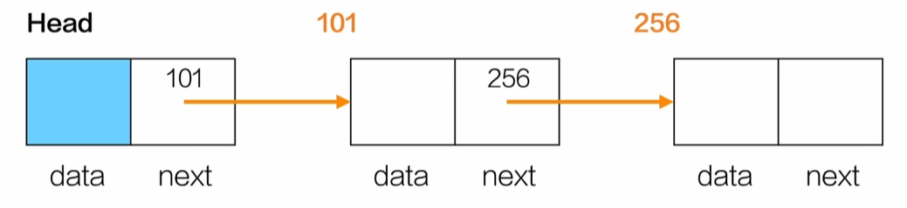

找到头部数据后，可以在后面呢指针域找到下一个数据域的地址

##### 1.单链表-初始化

先建立一个头节点指向NULL（空节点）

```c
Node* initList()
{
    Node *head=(Node*)malloc(sizeof(node));
    //申请一个大小为node的内存
    head->data=0;
    head->next=NULL;
    return head;//将initList函数的返回值返回为头节点
}
int main()
{
    Node *list=initList();
    return 1;
}
```

具体效果如图所示

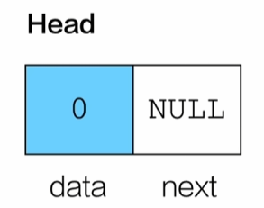

##### 2.单链表-插入数据

插入数据分为两种，头插法，尾插法。

其中尾插法需要使用并学会链表的遍历来获取尾节点的地址


###### 头插法  insertHead

顾名思义，就是在头节点之后的指针域开始插入下一个数据域的地址

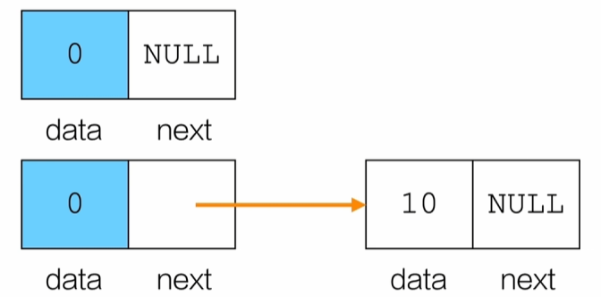

```c
int insertHead(Node* L,ElemType e)
{
    Node *p=(Node*)malloc(sizeof(node));
    //创建了一个新节点
    p->data=e;//在新的数据域中放了e
    p->next=L->next;
    //将L的后继（next原本为NULL）赋值给p的后继
    L->next=p;//将新节点的数据域的地址赋值给L
}
int main()
{
    Node *list=initList();
    insertHead(list,10);
    insertHead(list,20);
}
```

**在原有长链表插入时需要注意**：

如果在原有的长链表中使用头插法进行插入数据就需要注意顺序，主要按照以下重要步骤：

1.先创建一个新节点，使新节点的指针域指向要插入部分的数据域

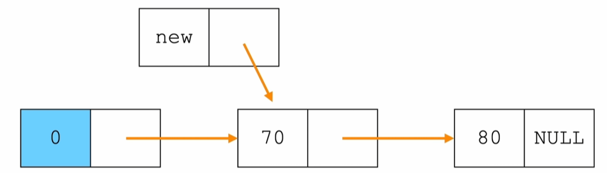

2.再将头节点的指针域指向新建立的节点的数据域

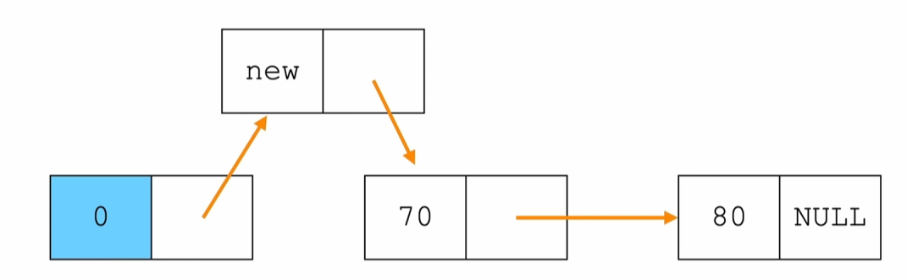

不可搞反顺序，这样可以确保链表的结构不会断裂，始终为线性


###### 单链表-遍历 listNode

主要原理是从第一个有数据的链表开始判断指针域是否为NULL

​	若不是NULL则通过指针所指地址找下一个数据域并继续判断其指针域是否为NULL

​	若找到NULL空指针，则遍历结束

```c
void listNode(Node* L)
{
    Node *p=L->next;//找头节点后第一个节点数据集
    while(p!=NULL)
    {
     printf("%d\n",p->data);   
    }
    printf("\n");
}
```

###### 尾插法 insterTaill

先通过遍历获得尾节点的数据域地址`get_tail`

```c
Node* get_tail(Node *L)
{
    Node *p = L;
    while(p->next != NULL)
    {
        p = p->next;
    }//开始遍历发现指针域不是NULL就继续找
    return p;//返回NULL的指针地址
}
```


再创立新节点，

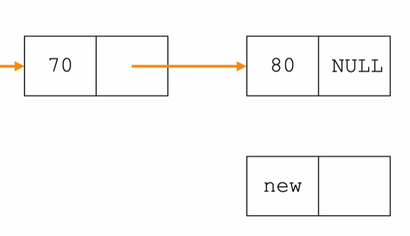

将原来尾节点的指针域`NULL`指向新节点的数据域，

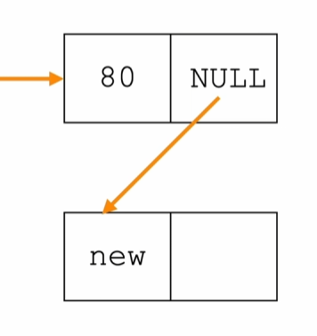

最后把旧尾节点的`NULL`赋予给新节点的指针域，构成新的指针域

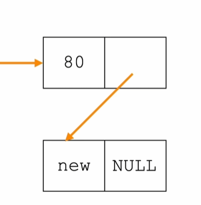

代码部分

`*tall`为尾节点指针，`e`代表所要插入的值

```c
Node* insertTail(Node *tail, ElemType e)
{
    Node *p = (Node*)malloc(sizeof(Node));
    p->data = e;//建立新节点
    tail->next = p;
    p->next = NULL;
    return p;
    //获取到新插入节点的指针，从而更新尾指针，保持链表的完整性
}
```

##### 3.单链表-在指定位置插入数据 insertNode

主要步骤为

1.找到要插入位置的上一个节点的地址域

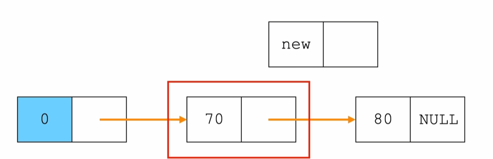

2.新节点地址域指向后面节点的数据域

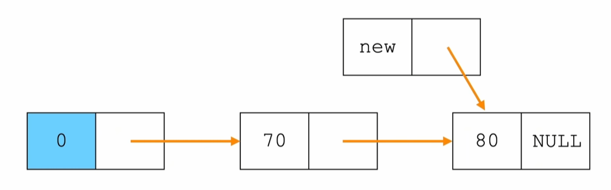

3.最后让上一个的地址域指向新节点的数据域

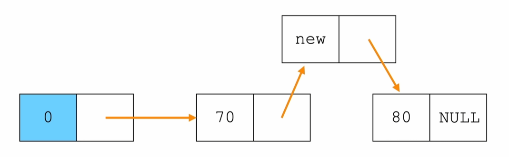

代码部分：

`Node *L`代表所创建的链表 `pos`代表所插入的位置 `e`代表所插入的数据

```c
int insertNode(Node *L, int pos, ElemType e) {
    Node *p = L;
    int i = 0;
    while (p != NULL && i < pos-1)
    {
        p = p->next;
        i++;
    }//从头遍历到想插入的位置，获取节点地址
    if (p == NULL) {
        return 0;
    }
    //要插入的新节点newNpde
    Node *newNode = (Node*)malloc(sizeof(Node));
    newNode->data = e;
    newNode->next = p->next;
    p->next = newNode;
    return 1;
}
```

##### 4.单链表-删除节点 deleteNode

1.找到要删除节点的前驱节点指针`prev`

```text
头节点 → A → B → C → D → NULL
        ↑
       prev
```

2.用指针`delNode`记录要删除的节点地址

```text
头节点 → A → B → C → D → NULL
        ↑    ↑
       prev delNode
```

3.改变`prev`的后继(`next`)节点地址实现删除

```text
头节点 → A →      C       →D→ NULL
        ↑      ↑     ↑
       prev delNode next
        \___________/
```

4.对删除的节点进行内存的释放

代码示例：

```c
int deleteNode(Node *L, int pos) 
{
    Node *prev = L;
    int i = 0;
    
    // 找到要删除节点的前一个节点
    while(i < pos-1 && prev != NULL)
    {
        prev = prev->next;
        i++;
    }
    
    // 检查位置是否有效
    if(prev == NULL || prev->next == NULL) 
    {
        return 0; // 删除失败
    }
    
    // 执行删除操作
    Node *delNode = prev->next;  // 保存要删除的节点
    prev->next = delNode->next;  // 跳过要删除的节点
    free(delNode);               // 释放内存
    
    return 1; // 删除成功
}
```

##### 5.单链表-获取链表长度 listLength

一直判断`next`后继指针域是否为`NULL`，如果不是就继续计数，是的话就停止，最后返还`length`到函数值

```c
int listLength(Node *L)
{
    Node *p=L;
    int length=0;
    while(p！=NULL)
    {
        p=p->next;
        length++;
    }
    return length;
}
```

##### 6.单链表-释放链表 freeList

保留**头节点！！头节点！！头节点！！**释放头节点后面的内容

1.指针`p`指向头节点后的第一个节点

2.判断指针`p`是否指向空节点

3.如果不为`NULL`,用指针`q`记录指针`p`的后继节点

4.释放指针`p`指向的节点

5.指针`p`和`q`指向同一个节点，循环上面操作

```c
// 释放链表
void freeList(Node *L)
{
    Node *p = L->next;
    Node *q;
    
    while(p != NULL)//每次循环判断所指地址是否为空
    {
        q = p->next;
        free(p);
        p = q;
    }
    L->next = NULL;
}
```

过程示例

```text
初始链表：头节点 → A → B → C → NULL
步骤1：p指向A，q指向B，释放A
步骤2：p指向B，q指向C，释放B  
步骤3：p指向C，q指向NULL，释放C
结果：头节点 → NULL
```

##### 链表应用

###### 1.反转链表 reverseList

将链表从后往前逆序输回

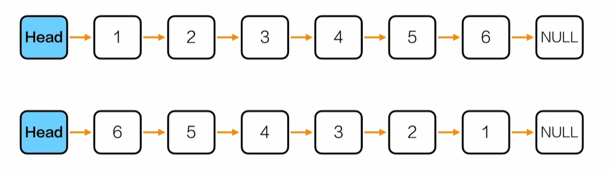

使用三个指针：`prev`、`curr`、`next`，逐个反转节点指向

- `prev`：指向已反转部分的头节点（`first`）

- `curr`：指向当前待反转的节点（`second`）

- `next`：临时保存下一个节点，防止断链（`third`）

  ```text
  初始: NULL ← prev   curr → 1 → 2 → 3 → 4 → 5 → NULL
        ↓
  第1次: NULL ← 1 ← prev   curr → 2 → 3 → 4 → 5 → NULL
        ↓  
  第2次: NULL ← 1 ← 2 ← prev   curr → 3 → 4 → 5 → NULL
        ↓
  第3次: NULL ← 1 ← 2 ← 3 ← prev   curr → 4 → 5 → NULL
        ↓
  第4次: NULL ← 1 ← 2 ← 3 ← 4 ← prev   curr → 5 → NULL
        ↓
  第5次: NULL ← 1 ← 2 ← 3 ← 4 ← 5 ← prev   curr → NULL
  ```

  ```text
  初始指针位置：
  prev = NULL
  curr = 1 → 2 → 3 → 4 → 5 → NULL
  next = NULL
  ```

1.`prev`先指向空值，`curr`指向第一个需要反转的节点，`next`指向下一个节点

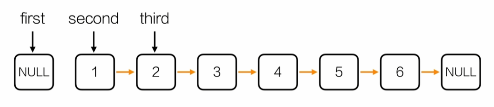

2.再让`curr`所指的节点指向`prev`所指的节点

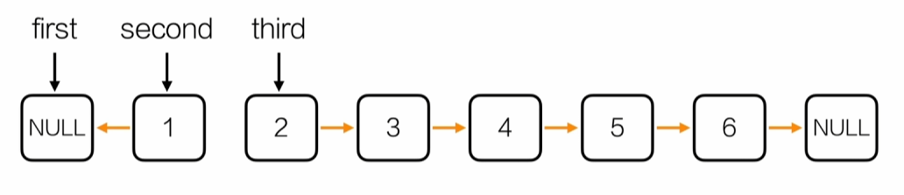

3.将三个节点整体向后挪

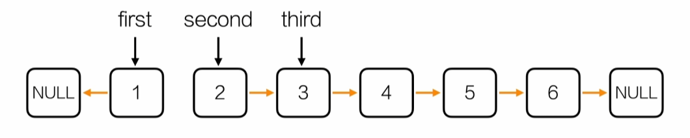

4.重复以上步骤后，直到`curr`指向空值`NULL`

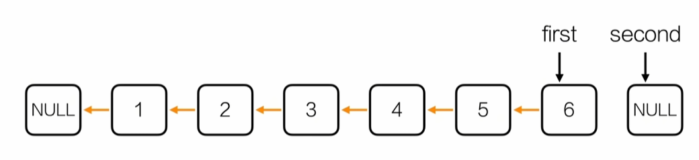

5.最后安装头节点

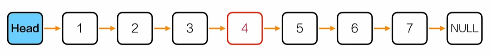

在奇数个节点中删除中间的节点（4），若为偶数个的话就删除靠尾节点的节点

**使用快慢指针：**

`fast`:每次遍历两步，一旦发现下一个节点 或 *当前节点为空（节点数为偶数）*就停止

`slow`:每次遍历一步，`fast`停止时`slow`就停止

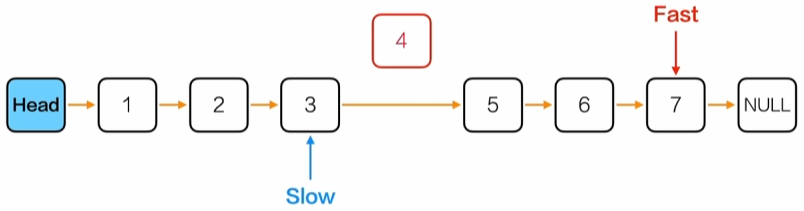

```text
初始：
fast = 2 → 3 → 4 → 5 → NULL
slow = 1 → 2 → 3 → 4 → 5 → NULL

第1次循环：
fast = 4 → 5 → NULL
slow = 2 → 3 → 4 → 5 → NULL

第2次循环：
fast = NULL (因为fast->next->next = 5->next = NULL)
slow = 3 → 4 → 5 → NULL

循环结束，slow指向节点3
删除slow->next，即节点4
```


```c
// 删除中间节点 
int delMiddleNode(Node *head)
{
    // 处理空链表和单节点链表
    if (head == NULL || head->next == NULL) {
        return 0; // 删除失败
    }
    
    // 处理双节点链表的特殊情况
    if (head->next->next == NULL) {
        Node *q = head->next;
        head->next = NULL;
        free(q);
        return 1;
    }
    
    Node *fast = head->next;
    Node *slow = head;

    // 快慢指针找到中间节点的前一个节点
    while(fast != NULL && fast->next != NULL && fast->next->next != NULL)//这一部分最重要
    {
        fast = fast->next->next;
        slow = slow->next;
    }
    
    // 安全删除中间节点
    if (slow->next != NULL) {
        Node *q = slow->next;
        slow->next = q->next;
        free(q);
        return 1;
    }
    
    return 0;
}
```

#### 单向循环链表

​		循环链表(Circular Linked List)是另一种形式的链式存储结构。其特点是表中最后一个节点的指针域指向头节点，整个链表形成一个环。
​		当链表遍历时，判别当前指针`p`是否指向表尾结点的终止条件不同。

在单链表中，判别条件为 `p!=NULL` 或 `p->next!=NULL`，

而循环单链表的判别条件为`p!=L` 或 `p->next!=L`。


##### **判断链表是否有环**

使用快慢指针：

- `fast`：每次移动两步
- `slow`：每次移动一步

两个指针相遇，说明存在有环。

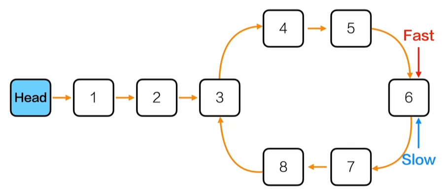

代码示例：

```c
int isCycle(Node *head)
{
    Node *fast = head;
    Node *slow = head;

    while( fast != NULL && fast->next != NULL )
    {
        fast = fast->next->next;
        slow = slow->next;
        if (fast == slow)
        {
            return 1;
        }
    }

    return 0;
}
```


##### **怎么找环的入口？**

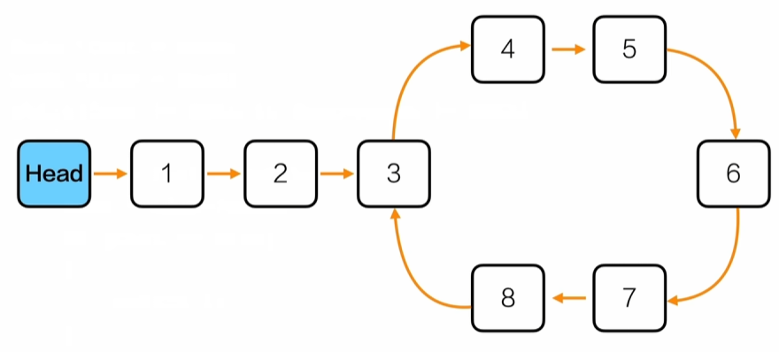

通过数学推导：已知相遇点（即找判断是否有环的条件）

则整个过程可以列为以下步骤

```text
头节点 → [距离a] → 环入口 → [距离b] → 相遇点 → [距离c] → 环入口
```

**关键变量定义**

- `a`：头节点到环入口的距离
- `b`：环入口到相遇点的距离
- `c`：相遇点到环入口的距离（环的剩余部分）
- `n`：快指针在环内跑的圈数

**1.判断有环时（快慢指针相遇）：**

​	慢指针走的距离：`a + b`

​	快指针走的距离：`a + b + n(b + c)`

**2.由于快指针速度是慢指针速度两倍**

则可以推导出

```text
2(a + b) = a + b + n(b + c)
a + b = n(b + c)
a = n(b + c) - b
a = (n - 1)(b + c) + c
```

即为`a = (n - 1)*环长度 + c`

**头节点到环入口的距离 = 相遇点到环入口的距离 + (n-1)×圈环的长度**

1. **当慢指针从头节点走到环入口时**，走了距离 `a`

2. **同时快指针从相遇点也走了距离 `a`**

3. 由于 `a = (n - 1)*环长度 + c`，快指针走了：

   - 先从相遇点走 `c` 到达环入口
   - 再走 `(n-1)` 圈环，最终回到环入口

   **这意味着**：

   - 从头节点走 `a` 步到达环入口
   - 从相遇点走 `c` 步也到达环入口（加上若干整圈）

   所以在此时`fast`指针和`slow`指针同速度走一步即可

   **所以两个指针会在环入口相遇！**

```c
Node* findCycleEntry(Node *head) {
    if (head == NULL) return NULL;
    
    Node *fast = head;
    Node *slow = head;
    int hasCycle = 0;
    
    // 检测是否有环
    while (fast != NULL && fast->next != NULL) {
        fast = fast->next->next;
        slow = slow->next;
        if (fast == slow) {
            hasCycle = 1;
            break;
        }
    }
    
    // 如果没有环，返回NULL
    if (!hasCycle) return NULL;
    
    // 找到环的入口
    slow = head;//慢指针重置到头节点，快指针还在相遇点
    while (slow != fast) {
        slow = slow->next;
        fast = fast->next;
        //两指针同速相遇
    }
    
    return slow;  // 环的入口节点
}
```

#### 双向链表

​		链式存储结构的节点中只有一个指示直接后继的指针域，由此，从某个结点出发只能顺指针向后寻查其他节点。若要寻查结点的直接前驱、则必须从表头指针出发。换句话说，在单链表中，查找直接后继的执行时间为O(1)，而查找直接前驱的执行时间为O(n)。

​		为克服单链表这种单向性的缺点，可利用双向链表(Double Linked List)。在双向链表的节点中有两个指针域，一个指向直接后继，另一个指向直接前驱。

##### 双向链表存储结构 Node

```c
typedef int ElemType;
typedef struct node{
    ElemType data;
    struct node *prev, *next;
} Node;
```

**结构组成**

- **`data`**：存储节点数据（整型）
- **`prev`**：指向前一个节点的指针
- **`next`**：指向后一个节点的指针

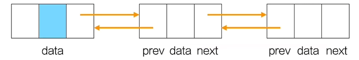

##### 1.双向链表-初始化 initList

```c
// 初始化链表 
Node* initList()
{
    Node *head = (Node*)malloc(sizeof(Node));
    head->data = 0;
    head->next = NULL;
    head->prev = NULL;
    return head;
}
```

**初始化内容：**

**分配内存**：为头节点分配空间

**设置数据**：`data = 0`（头节点通常不存储有效数据）

**设置指针**：

- `next = NULL`：表示链表为空
- `prev = NULL`：头节点的前驱为NULL

##### 2.双向链表-插入数据

###### 双向链表-头插法 insertHead

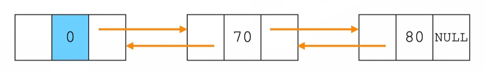

1.新节点的`prev`指向头节点

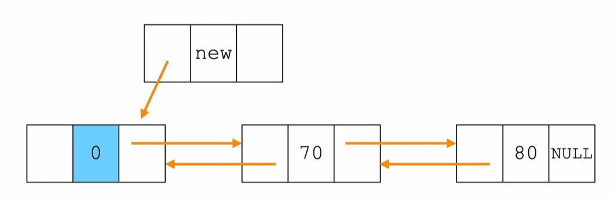

2.新节点的`next`指向指向原第一个节点A

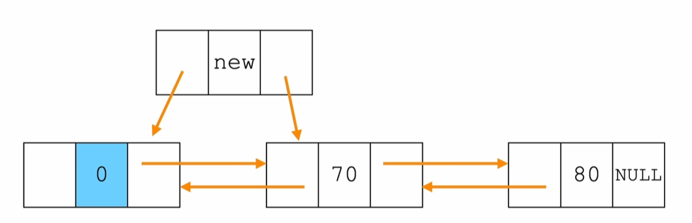

3.原第一个节点的前驱`prev`指向新节点

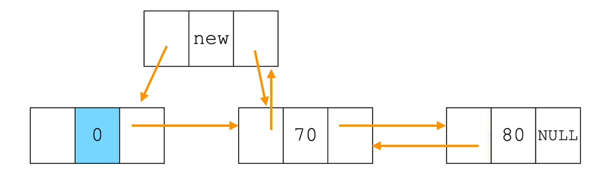

4.头节点`next`指向新节点

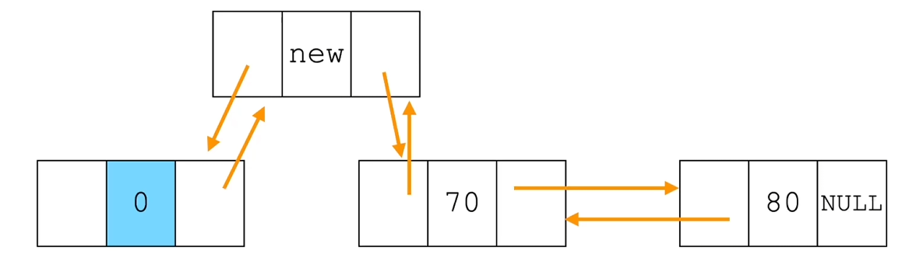

代码示例：

```c
//头插法
int insertHead(Node* L, ElemType e)
{
    Node *p = (Node*)malloc(sizeof(Node));
    p->data = e;//创建新节点
    p->prev = L;//新节点的前驱指向头节点
    p->next = L->next;//新节点的后继指向原第一个节点A
    if (L->next != NULL)
    {
        L->next->prev = p;
    }// 原第一个节点A的前驱指向新节点
    L->next = p;// 头节点指向新节点
    return 1;
}
```

###### 双向链表-遍历 

双向链表由于同时具有前驱(`prev`)和后继(`next`)指针，支持两种遍历方式：**正向遍历**和**反向遍历**。

从链表头部开始，沿着`next`指针方向遍历到尾部。

```c
// 正向遍历（带头节点）
void traverseForward(Node* head) {
    if (head == NULL) {
        printf("链表不存在\n");
        return;
    }
    if (head->next == NULL) {
        printf("链表为空\n");
        return;
    }
    Node* current = head->next;  // 跳过头节点
    printf("正向遍历: ");
    while (current != NULL) {
        printf("%d ", current->data);
        current = current->next;
    }
    printf("\n");
}
```

从链表尾部开始，沿着`prev`指针方向遍历到头部。

```c
// 反向遍历（带头节点）
void traverseBackward(Node* head) {
    if (head == NULL) {
        printf("链表不存在\n");
        return;
    }
    if (head->next == NULL) {
        printf("链表为空\n");
        return;
    }
    // 先找到尾节点
    Node* Tail = head->next;
    while (Tail->next != NULL) {
        Tail = Tail->next;
    }
    printf("反向遍历: ");
    // 从尾节点向前遍历，直到头节点之前
    while (current != head) {
        printf("%d ", current->data);
        current = current->prev;
    }
    printf("\n");
}
```

###### 双向链表-尾插法 insertTail

1.建立一个新节点之后，将新节点的前驱`prev`指向原来的尾节点`70`

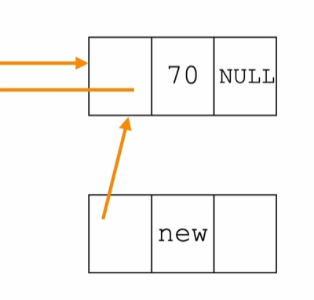


2.原来尾节点的后继`next`指向新节点`new`

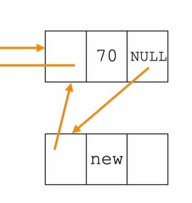

3.把空值`NULL`赋值给新节点的`next`，变成新的尾节点

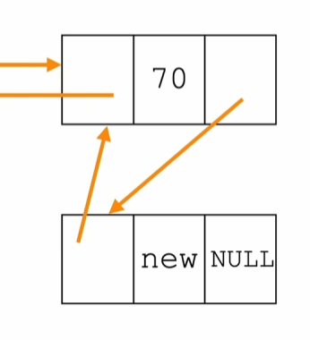

代码示例：

```c
//尾插法
Node* insertTail(Node *tail, ElemType e)
{
    Node *p = (Node*)malloc(sizeof(Node));
    p->data = e;//创建新节点
    p->prev = tail;//新节点的前驱指向尾节点
    tail->next = p;//尾节点的后继指向新节点
    p->next = NULL;//新节点后继赋值NULL成为新的尾节点
    return p;
}
```

###### 双向链表-指定位置插入数据 insertNode

两种办法，通过前置节点`prev`，通过后置节点`next`找到插入地点进行插入。

以`prev`为例：

1.先找前置节点，让新节点`prev`指向它（70）

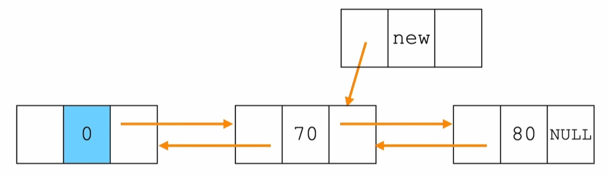

2.让新节点的`next`指向目标节点的后一个（80）

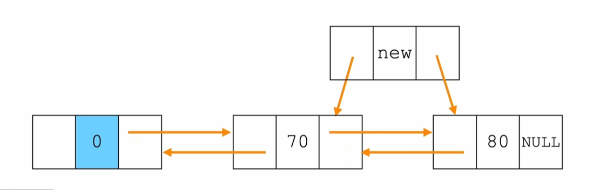

3.80的`prev`指向新节点`new`

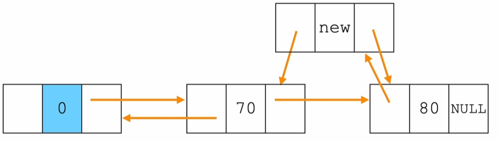

4.70的`next`指向新节点`new`

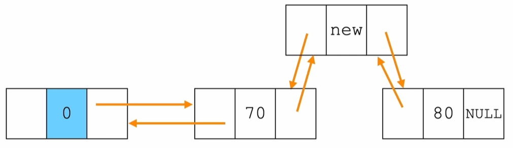

```c
int insertNode(Node *L,int pos,ElemType e)
{
    Node *p=L;
    int i=0;
    while(i<pos-1)//通过i来判断在哪插入
    {
        p=p->next;//指向插入位置的前置节点
        i++;
        if(p==NULL)
        {//如果没有就推出运行，插入失败
            return 0;
        }
    }
    Node * q=(Node*)malloc(sizeof(node));
    q->data=e;
     //q为新节点
    q->prev=p;//操作一
    q->next=p->next;//操作二
    p->next->prev=q;//操作三
    p->next=q;//操作四
    return 1;
}
```

##### 3.双向链表-删除节点 deleteNode

还是两种办法，找目标节点的`prev`或找后置节点`next`

以找前置节点为例：

1.找到要删除节点的前置节点`p`

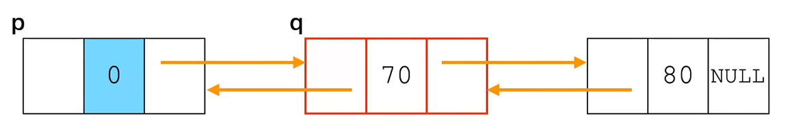

2.用指针`q`记录要删除的节点

4.通过改变`p`的后继节点实现删除

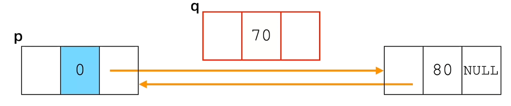

5.释放删除节点的空间

```c
//删除节点
int deleteNode(Node *L,int pos)
{
    Node *p=L;
    int i=0;
    while(i<pos-1)
    {
        p=p-next;
        i++;
        if(p==NULL)
        {
            return 0;
        }//找到要删除节点的前置节点p
    }
    if(p->next==NULL)
    {
        printf("要删除的位置错误\n");
        return 0;
    }
    Node *q=p->next;//q指向要删除的节点
    p->next=q->next;
    q->next->prev=p;//将删除后的节点两端连接
    free(q);
    return 0;
}
```

##### 4.双向链表-释放链表 freeList

与单链表相同

```c
//释放链表
void freeLiist(Node *L)
{
    Node *p=L->next;
    Node *q;
    while(p!=NULL)
    {
        q=p->next;
        free(p);
        p=q;
    }
    L->next=NULL;
}
```


### 顺序表vs链表


| 比较项目     | 具体方面   | 顺序表                                                       | 链表                                                    |
| :----------- | :--------- | :----------------------------------------------------------- | :------------------------------------------------------ |
| **空间**     | 存储空间   | 预先分配，会出现闲置或溢出现象                               | 动态分配，不会出现存储空间闲置或溢出现象                |
| **空间**     | 存储密度   | 不用为表示节点间的逻辑关系而增加额外的存储，存储密度等于1    | 需要借助指针来体现元素间的逻辑关系，存储密度小于1       |
| **时间**     | 存取元素   | 随机存取，按位置访问元素的时间复杂度为 O(1)                  | 顺序存取，按位置访问元素时间复杂度为 O(n)               |
| **时间**     | 插入、删除 | 平均移动约表中一半元素，时间复杂度为 O(n)                    | 不需要移动元素，确定插入、删除位置后，时间复杂度为 O(1) |
| **适用情况** | -          | （1) 表长变化不大，且能事先确定变化的范围 <br />（2) 很少进行插入或删除操作，经常按元素位置序号访问数据元素 | （1) 长度变化较大<br />（2) 频繁进行插入或删除操作      |


## 栈和队列 


**栈的定义**

**栈(stack)**是限定仅在表尾进行插入或删除操作的线性表。因此对栈来说，表尾端有其特殊含义，称为**栈顶(top)**，相应地，表头端称为**栈底(bottom)**。不含元素的空表称为**空栈**。
		假设 S=($a_1, a_2,…,a_n$)，则称 $a_1$为栈底元素，$a_n$ 为栈顶元素。栈中元素按 $a_1,a_2,…,a_n$ 的次序进栈，退栈的第一个元素应为栈顶元素。换句话说，栈的修改是按照**后进先出**的原则进行的。因此，栈又称为后进先出(Last In First Out,LlFO)的线性表。

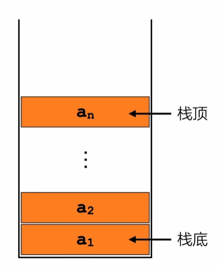

**栈是限制插入和删除**操作，只能在一个位置进行的表，该位置是表的末端，叫作**栈顶(top)**。对栈的基本操作有**进栈(push)**和**出栈(Pop)**，前者相当于**插入**后者则是**删除最后插入的元素**。


**队列的定义**

**队列(queue)**是一种**先进先出(FirstInFirst Out,FIFO)的线性表**。它只允许在表的一端进行**插入**，而在另一端**删除元素**。在队列中，允许插入的一端称为**队尾(rear)**,允许删除的一端则称为**队头(front)**。假设队列为$q=(a_1,a_2,…a_n)$，那么，$a_1$ 就是队头元素，$a_n$ 就是队尾元素。队列中的元素是按照 $a_1,a_2,…a_n$的顺序进入的，退出队列也只能按照这个次序依次退出，也就是说，只有在 $a_1，a_2,…,a_{n-1}$都离开队列之后，$a_n$ 才能退出队列。

*注：像排队打饭*

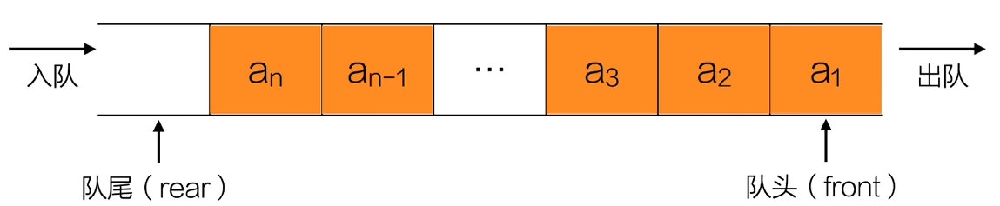


### 栈的顺序结构实现

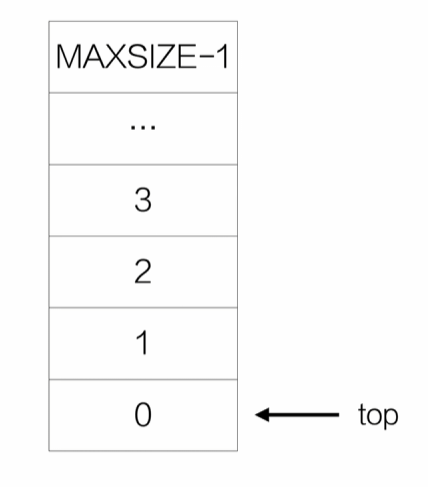

`top`指针用于指向栈顶，可以充当栈内数据下标的作用

```c
#define MAXSIZE=100
typedef int ElemType;
typedef struct{
    ElemType data[MAXSIZE];
    int top;
}Stack;
```

#### 1.栈的顺序结构-初始化 initStack

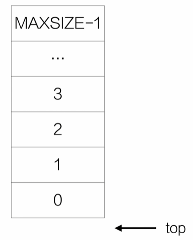

由于一开始声明过`MAXSIZE=100`，这时就已经开辟过栈内存的空间，相当于已经初始化过了，指针`top=-1`是因为`top`相当于一个下标作用，例如：第一个数据的下表就是`top+1`就是`0`。

```c
#define MAXSIZE=100
typedef int ElemType;
typedef struct{
    ElemType data[MAXSIZE];
    int top;
}Stack;
void initStack(Stack *s)
{
    s->top= -1;
}
```

#### 2.栈的顺序结构-判断栈是否为空 isEmpty

如果从未有过插入数据，那么`top`则一直为-1，所以仅需判断`top`是否是-1即可。

```c
int isEmpty(Stack *s)
{
    if(s->top==-1)
    {
        printf("空\n");
        return 1;
    }
    else
    {
        return 0;
    }
}
```

#### 3.栈的顺序结构-进栈/压栈 push

使用指针`top`充当一个下标的作用，通过`top`进行添加数据

```c
int push(Stack *s,ElemType e)//进栈
{
    if(s->top>=MAXSIZE-1)
    {
        printf("满\n");
        return 0;//判断是否满，不满继续插入
    }
    s->top++;//找到空位就+1后移指针
    s->data[s->top]=e;
    return 1;
}
```


#### 4.栈的顺序结构-出栈 pop

同样沿用顺序表的风格，只覆写不删除，直接将下标指针`top`进行相应回调即可。

```c
Elemtype pop(Stack *s,ElemType *e)
{
    if(s->top==1)
    {
        printf("空\n");
        return 0;
    }
    *e=s->data[s->top];//直接将相应位置设定为出栈
    s->top--;
    return 1;
}
```


#### 5.栈的顺序结构-获取栈顶元素 getTop

就是获取最后放入的那个元素

```c
int getTop(Stack *s,ElemType *e)
{
    if(s->top==-1)
    {
        printf("空\n");
        return0;
    }//先判断是否是空栈
    *e=s->data[s->top];
    return 1;
}
```


#### 6.栈的顺序结构-动态内存分配

使用了**堆内存**

```c
#define MAXSIZE 100
typedef int ElemType;
typedef struct
{
    ElemType *data;
    int top;
}Stack;
Stack* initStack()
{
    Stack *s = (Stack*)malloc(sizeof(Stack));
    s->data = (ElemType*)malloc(sizeof(ElemType) * MAXSIZE);
    s->top = -1;
    return s;
}
```

*注意：代码中使用了`malloc`函数，在实际使用时需要包含`stdlib.h`头文件。*

`initStack()`函数：初始化栈，分配内存空间并将栈顶指针设为-1（空栈）

此时`data`变为了指针，需要初始化，下标就使用了`int`类型存入

### 栈的链式结构实现

虽然结构体形式和原来链式结构相同，但是操作和逻辑必须应符合栈的操作和逻辑，头节点的第一个有效节点就是**栈顶**，尾节点就相当于**栈底**，**压栈**就相当于单链表中的**头插法**，只有一个头节点，就相当于**空栈**，**获取栈顶**，就是找头节点的第一个有效节点`data`。


```c
typedef int ElemType;
typedef struct stack
{
    ElemType data;
    struct stack *next;
}Stack;
```


##### 1.栈的链式结构实现-初始化 initStack

```c
//单链
typedef int ElemType;

typedef struct stack
{
    ElemType data;
    struct stack *next;
} Stack;

Stack* initStack()
{
    Stack *s = (Stack*)malloc(sizeof(Stack));
    s->data = 0;
    s->next = NULL;
    return s;
}
```

就是相当于单链表的初始化，跟其初始化相同

##### 2.栈的链式结构实现-判断栈是否为空 isEmpty

```c
int isEmpty(Stack *s)
{
    if(s->next==NULL)//寻找链表尾节点NULL
    {
        printf("空\n");
        return 1;
    }
    else
    {
        return 0
    }
}
```

##### 3.栈的链式结构实现-进栈/压栈 push

跟链表的头插法相同

```c
int push(Stack *s,ElemType e)
{
    Stack *p=(Stack*)malloc(sizeof(Stack));
    Stack->data =e;//创建新节点
    p->next=s->next;
    s->next =p;
    return 1;
}
```

##### 4.栈的链式结构实现-出栈 pop

在这里体现出栈结构和普通的链表的区别了，有头节点的情况下，链式结构的栈可以轻易的执行删除节点（出栈）的操作，具体操作还是和链表的删除节点操作是一样的。

```c
int pop(Stack *s, ElemType *e)
{
    if(s->next == NULL)
    {
        printf("空的\n");
        return 0;
    }//先检查是不是空栈
    *e = s->next->data;
    Stack *q = s->next;
    s->next = q->next;
    free(q);
    return 1;
}
```


##### 5.栈的链式结构实现-获取栈顶元素 getTop

`*e = s->next->data`就意味着如果不是空栈，那就找头节点的第一个有效节点作为栈顶

```c
int getTop(Stack *s, ElemType *e)
{
    if (s->next == NULL)
    {
        printf("空的\n");
        return 0;
    }//同样先判断是否hong'h'z
    *e = s->next->data;
    return 1;
}
```

### 队列的顺序结构实现

```c
#define MAXSIZE 100
typedef int ElemType;
typedef struct{
    ElemType data[MAXSIZE];
    int front;//队头
    int rear;//队尾
}quene;
```

提前在`MAXSIZE`中规定好队列的大小，使用两个指针来标记大小

#### 1.队列的顺序结构-初始化 initQueue

```c
#define MAXSIZE 100
typedef int ElemType;
typedef struct{
    ElemType data[MAXSIZE];
    int front;//队头
    int rear;//队尾
}quene;
void initQueue(Queue *Q)
{
    Q->front=0;
    Q->rear=0;
}
```

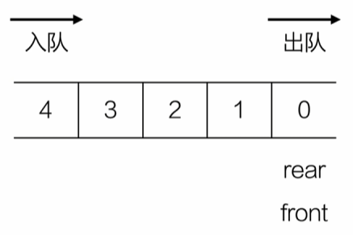

将`front`,`rear`初始化为`0`，使得两个指针都在一起

#### 2.队列的顺序结构-判断队列是否为空 isEmpty

当两个指针`rear`和`front`相遇时判断队列为空，**为什么**？

**1.入队过程**


通过使用队尾指针`rear`来确定数据下标。

**2.出队过程**

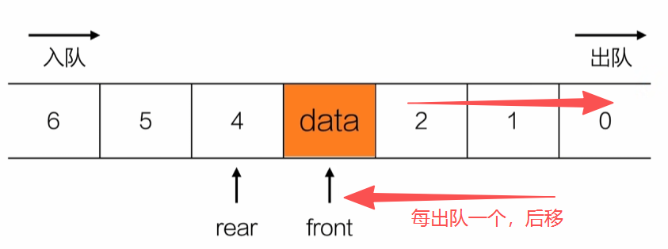

`front`用来记录队头下标，每出一个数据就向左移。

**显然当两指针相遇时，整个队列就是空队列**

```c
int isEmpty(Queue *Q)
{
    if(Q->front==Q->rear)
    {
        printf("空的\n");
        return 1;
    }
    else 
    {
        return 0;
    }
}
```


#### 3.队列的顺序结构-出队 dequeue

1.首先就判断队列是不是空的

2.直接将指针`front`后移，将下标改变

`Q`表示队列（指向`front`队头），使用变量`e`来临时表示出队元素，然后，让队列`Q`的队头`front`向后移动，表示出队，最后用`e`来用作函数的输出。

```c
ElemType dequeue(Queue *Q)
{
    if (Q->front == Q->rear)
    {
        printf("空的\n");
        return 0;
    }
    ElemType e = Q->data[Q->front];
    Q->front++;
    return e;
}//不是本质的‘删除’，只是移动指针方便以后覆写
```


#### 4.队列的顺序结构-入队及调整 equeue & adjustQueue


##### **入队操作**

就像上文提到，每加入一个元素，就使队尾指针`rear`向后移动一位

1.先判断队尾`rear`是否超出内存，若没超出就进行后面操作

*注：`rear`到内存满的地方（队尾到头）了怎么办？*（假溢出）

2.将`rear`指向的内存处直接插入数据

2.移动指针`rear`到后一位

代码示例：

```c
int equeue(Queue *Q, ElemType e)
{
    if (Q->rear >= MAXSIZE)//判断
    {
        if(!adjustQueue(Q))
        {
            return 0;
        }
    }
    Q->data[Q->rear] = e;
    Q->rear++;//移动尾标
    return 1;
}
```

##### **搬运调整元素**

队尾满的时候（如下图），就**调整队列**`adjustQueue`进行搬运

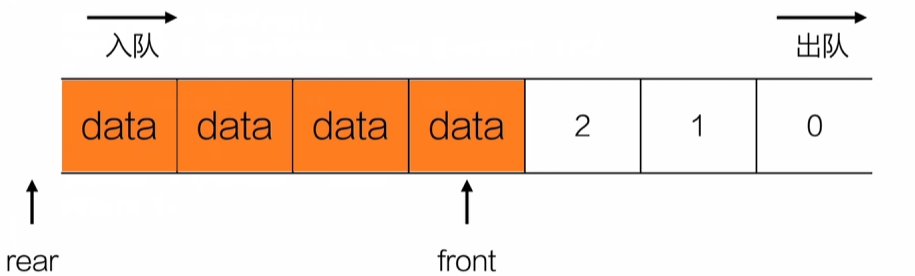

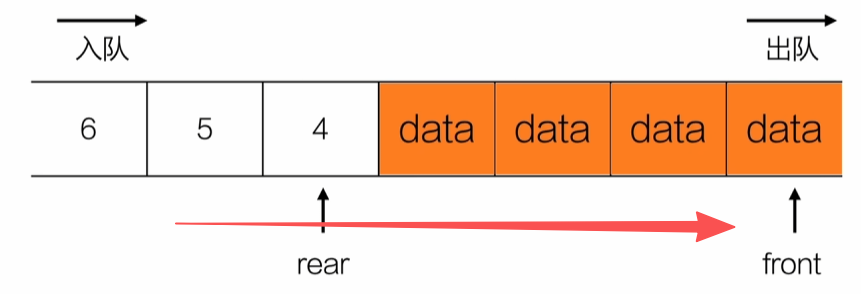

1.判断`front`队头是否大于0（说明整个表前面有空位），没有就满了

2.记录通过队头`front`与内存头记录 差值`margin`

3.将表内元素一个个通过差值多少来进行向前搬运，完成后返回1（真值`ture`）

```c
int adjustQueue(Queue *Q)
{
    if (Q->front > 0)
    {
        int margin = Q->front;
        for (int i = Q->front; i <= Q->rear; ++i)
        {
            Q->data[i - margin] = Q->data[i];//用来实现每个元素移动到那个地方
        }
        Q->front = 0;
        Q->rear = Q->rear - margin;
        return 1;
    }
    else
    {
        printf("真的满了\n");
        return 0;
    }
}
```

#### 5.队列的顺序结构-获取队头数据 getHead

1.先判断是不是空队

2.使用临时指针临时存队头数据需要时再进行输出

```c
int getHead(Queue *Q, ElemType *e)
{
    if (Q->front == Q->rear)
    {
        printf("空的\n");
        return 0;
    }
    *e = Q->data[Q->front];
    return 1;
}
```

```c
//使用示例
ElemType value;
if (getHead(&myQueue, &value)) {
    printf("队首元素是：%d\n", value);
} else {
    printf("队列为空\n");
}
```


#### 6.队列的顺序结构-动态内存分配

```c
typedef struct
{
    ElemType *data;
    int front;
    int rear;
} Queue;

Queue* initQueue()
{
    Queue *q = (Queue*)malloc(sizeof(Queue));
    q->data = (ElemType*)malloc(sizeof(ElemType) * MAXSIZE);
    q->front = 0;
    q->rear = 0;
    return q;
}
```

**代码结构说明：**

1. **队列结构体定义**：

   `ElemType *data`：指向动态分配的数组，用于存储队列元素

   `int front`：队首指针（索引）

   `int rear`：队尾指针（索引）

2. **初始化函数 `initQueue()`**：

   使用 `malloc` 为队列结构体分配内存

   使用 `malloc` 为数据数组分配 `MAXSIZE` 大小的内存

   将 `front` 和 `rear` 都初始化为 0（空队列状态）

   返回初始化后的队列指针

**队列状态说明：**

空队列：`front == rear`

满队列：`rear == MAXSIZE`（在这个实现中）

元素存储在 `data[front]` 到 `data[rear-1]` 的位置

**内存布局示例：**

Queue结构体

| `data`  | 指向动态数组的指针 |
| :-----: | :----------------: |
| `front` |        `0`         |
| `rear`  |        `0`         |

*动态数组 (大小=MAXSIZE):[0] [1] [2]............[MAXSIZE-1]*

**注意：** 使用完毕后需要手动释放内存，先释放 `data` 数组，再释放队列结构体。

#### 7.队列的顺序结构-⚠循环队列

为了解决在入队出队后需要搬运元素所消耗的大量资源（搬运几千，几亿个元素时，就不好进行调整），这就需要使用循环队列来进行帮助

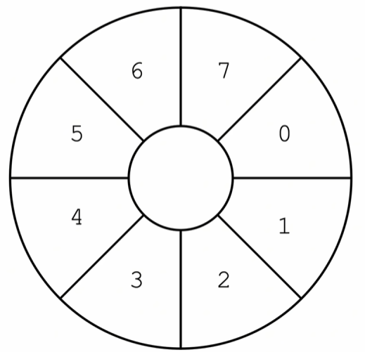

**除了在判断队满的条件与原队列的条件不同，其他都相同**

**判断队满条件**：`(Q->rear +1) % MAXSIZE == Q->front`

**具体原理**就是：

`Q->rear +1`：队尾下标+1，就是用来预判队尾`rear`下一个位置是否是队头`front`，不能直接用`reaar == front`直接判断（*这样就变成了队空条件*），同时为了显示真实位置与最大容量`MAXSIZE`的关系。

`%`：取余操作即为取模，如果整除就输出（余）`0`，未整除就输出余数

`==`:用于判断，是关系运算符*(就相当于数学里的`<,>,=`的作用)* ,而代码`=`用作**赋值**，就是将等号右边的值赋予给左边。

`Q->front`:就是指队头下标。

这样做确实简单快速，但会不会有什么不可避免的小缺点呢？

**缺点**：（为什么会有这样的缺点？）

​		**浪费一个存储栏位（数组位置）**

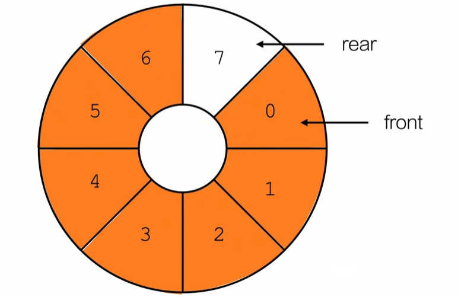

由于判断**队满**的**队尾指针**指向最后一个数据的**后**一个空栏位，比如某元素占用到上图`data[6]`，此时指针`rear`指向`data[7]`,同时满足队满判断条件，但是`data[7]`位置是空的无法写入元素，相当于尾指针`rear`占用了这个数组位置（这是比喻不是真的占用）。

##### 循环队列-入队 equeue

`Q->rear = (Q->rear + 1) % MAXSIZE`

这个用来替代`rear++`是因为现在是一个环形数据类型（`原来只有到7加到8，没有怎么办`）所以只需要`+1`后与`MAXSIZE`取模即可，这样赋值给队尾指针`rear`的地址就不会超过`MAXSIZE`。

```c
int equeue(Queue *Q, ElemType e)
{
    // 检查队列是否已满
    if ((Q->rear + 1) % MAXSIZE == Q->front)
    {
        printf("满了\n");
        return 0;  // 入队失败
    }
    
    // 将元素e放入队尾位置
    Q->data[Q->rear] = e;
    
    // 循环移动队尾指针
    Q->rear = (Q->rear + 1) % MAXSIZE;
    
    return 1;  // 入队成功
}
```

##### 循环队列-出队 dequeue

这个用来代替`front++`跟上面的入队原理相同，`*e`用来临时存储出队的元素的地址

```c
int dequeue(Queue *Q, ElemType *e)
{
    // 检查队列是否为空
    if (Q->front == Q->rear)
    {
        printf("空的\n");
        return 0;  // 出队失败
    }
    
    // 将队头元素保存到e指向的位置
    *e = Q->data[Q->front];
    
    // 循环移动队头指针
    Q->front = (Q->front + 1) % MAXSIZE;
    
    return 1;  // 出队成功
}
```


### 队列的链式结构实现

存储结构和原来链表大致相同，只是使用方法按照队列相同

队头，队尾可以链表头节点或尾节点，按照自己思考自行来写

定义两个指针`front`，`rear`用来标识和指向队头，队尾


```c
typedef struct QueueNode
{
    ElemType data;
    struct QueueNode *next;
}QueueNode;//存储结构就像原来链表的一样
typedef struct
{
    QueueNode *front;
    QueueNode *rear;
}Queue;//这个结构体用来单独存储队头队尾
```


#### 1.队列的链式结构-初始化 initQueue

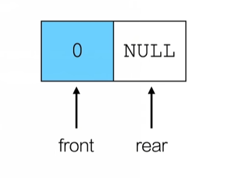

全都指向头节点

`frount`:指向头节点，数据域部分

`rear`:指向头节点，指针域部分

```c
Queue* initQueue()
{
    Queue *q = (Queue*)malloc(sizeof(Queue));
    QueueNode *node = (QueueNode*)malloc(sizeof(QueueNode));
    node->data = 0;
    node->next = NULL;
    q->front = node;
    q->rear = node;
    return q;
}
```


#### 2.队列的链式结构-入队 equeue

以尾插法为例，按链式结构一致，每一次将队尾指针指向尾节点

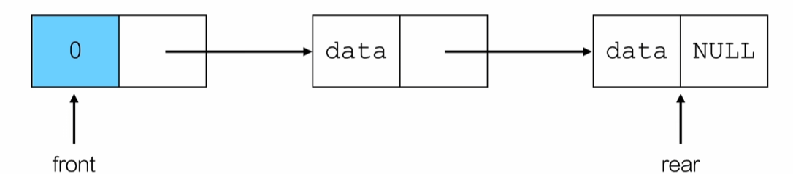

```c
void equeue(Queue *q, ElemType e)
{
    QueueNode *node = (QueueNode*)malloc(sizeof(QueueNode));
    node->data = e;
    node->next = NULL;
    q->rear->next = node;
    q->rear = node;//重定义后，将尾指针再次指向尾节点
}
```

#### 3.队列的链式结构-出队 dequeue

头节点的第一个有效数据节点进行释放即完成出队

1.先将头节点的后一个有效节点（即头节点的后继`next`进行赋值给临时指针`*node`。然后再用指针`*e`输出。

2.将头节点的指针域指向所删除元素的下一个元素的数据域，实现出队删除

3.判断是否是尾节点，如果是尾节点就需要让队头队尾指针都指向头节点

4.最后记得`free()`当时节点，不然会导致内存泄漏

```c
int dequeue(Queue *q, ElemType *e)
{
    QueueNode *node = q->front->next;
    *e = node->data;
    q->front->next = node->next;
    if (q->rear == node)
    {
        q->rear = q->front;
    }
    free(node);
    return 1;
}
```

#### 4.队列的链式结构-获取队头元素 getFront

判断完队列是不是空的，不是空的就对头元素进行输出

输出的就是头指针指向的后继数据域

```c
ElemType getFront(Queue *q)
{
    if (isEmpty(q))
    {
        printf("空的\n");
        return 0;
    }
    return q->front->next->data;
}
```


## 递归


在函数调用过程中，调用自己本身，叫做递归调用


#### 例子1：计算1~n的和 - 非递归方式 

用到了一个`for`循环来进行累加操作，

时间复杂度最坏就会变为`O（n）`

```c
int fun1(int n)
{
    int sum = 0;
    for (int i = 1; i <= n; i++)
    {
        sum += i;
    }
    return sum;
}
```


#### 例子2：计算1~n的和 - 递归方式 


```c
int fun2(int n)
{
    if (n == 1)
    {
        return 1;
    }
    else
    {
        return fun2(n-1) + n;
    }
}
```


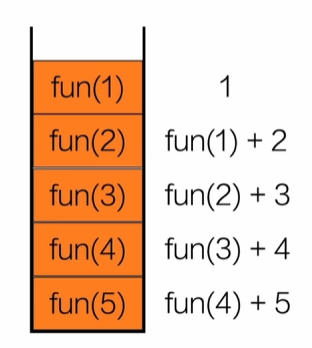

就类似一个栈的形式，先进后出，就像上图，以压栈的形式进入，最后每次数据出栈，从上累加到下算出总和。

**优点：**

- 代码简洁，逻辑清晰，更符合数学定义
- 对于某些问题（如树遍历、分治算法）更自然

**缺点：**

- **空间复杂度高**：O(n)，需要维护递归调用栈
- **性能开销大**：函数调用需要额外的栈帧操作
- **栈溢出风险**：当n很大时可能导致栈溢出
- **调试困难**：递归调用链较长时调试较复杂

#### 例子3：输出斐波那契数列第`n`项的值 -非递归

**斐波那契数列(Fibonaccisequence)**，又称黄金分割数列，因数学家莱昂纳多·斐波那契(Leonardo Fibonacci)以兔子繁殖为例子而引入，故又称“兔子数列”，其数值为:1、1、2、3、5、8、13、21、34…
		第 1、2 项为 1，从第 3 项开始每一项的值为前两项的和。

代码示例：

将前两位数字列出，使用`result`临时存储和输出第`i`个数的值，赋值给`last1`提前为下一循环做准备，最后输出`result`

```c
int fibonacci(int n)
{
    int last1 = 1;
    int last2 = 1;
    int result = 0;
    for (int i = 3; i <= n; i++)
    {
        result = last1 + last2;
        last2 = last1;
        last1 = result;
    }
    return result;
}
```

#### 例子4：输出斐波那契数列第`n`项的值 - 递归

$n$表示项数，直接表达出数列的定义，第 1、2 项为 1，从第 3 项开始每一项的值为前两项的和。

```c
int fibonacci(int n)
{
    if (n == 1 || n == 2)
    {
        return 1;
    }
    else
    {
        return fibonacci(n - 1) + fibonacci(n - 2);
    }
}
```


## 表达式求值：中缀、后缀


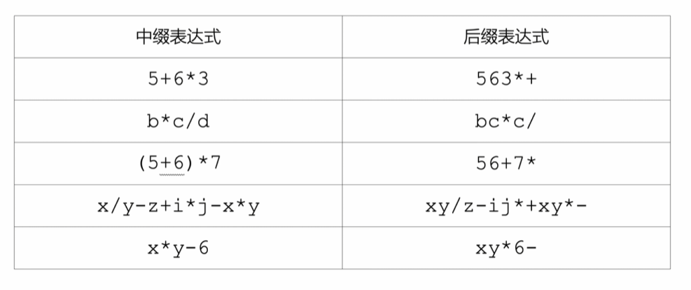


**中缀表示法**：

这是我们最熟悉、最常用的写法。

**定义**：运算符放在两个操作数**之间**。

**示例**： `A + B`， `(A + B) * C`

**特点**：

- **对人类友好**：非常符合我们的阅读和书写习惯。
- **需要处理优先级**：需要使用括号 `()` 和运算符优先级规则（先乘除后加减）来消除歧义。例如，`A + B * C` 和 `(A + B) * C` 的结果是不同的。
- **对计算机不友好**：计算机需要一套复杂的规则（或转换为其他形式）来理解和计算这种表达式。

**后缀表示法**：

也称为**逆波兰表示法**。

**定义**：运算符放在两个操作数**之后**。

**示例**：

- 中缀 `A + B` 变为后缀 `A B +`
- 中缀 `(A + B) * C` 变为后缀 `A B + C *`
- 中缀 `A + B * C` 变为后缀 `A B C * +` （因为 `*` 的优先级比 `+` 高，所以先结合）

**特点**：

- **无需括号**：表达式的计算顺序是明确的，完全不需要括号。
- **易于计算机计算**：使用一个**栈**数据结构就可以非常高效地计算出结果。
- **对人类不直观**：刚开始看会觉得不习惯。

#### 后缀表达式的计算

##### 枚举    *知识补充*

将变量的值一一**列举**出来，变量的值只限于列举出来的值的范围内

在枚举中列出的每一个值，称为**枚举元素**

每一个枚举元素由系统定义了一个用序号表示的数值，从0开始，分别为0，1，2，···，就类似于自己定义了一个数据类型。

**语法：**

```c
enum 枚举名
{
    枚举元素····
};
```

**示例及解释：**

```c
enum weekday
{
    mon,tue,wed,thu,fri,sat,sun
};
int main()
{
    enum weakday a;//建立完这个类型的值，就会有一定限制
    a=mon;//就是赋值的时候只能是枚举里的元素
    printf("%d",a);
}
```

1. 只要将里面填东西，这些元素的值就会从0开始向后赋值。

   例如：从`mon`开始到`sun`就会一词赋值为0，1，2，··· ，6。上面代码就会打印输出0出来

2. 想要从特定值开始输出也有一定做法

   ```c
   enum weekday
   {
       mon=1,tue,wed,thu,fri,sat,sun
   };//这样输出就是会从1开始向后顺延
   ```

3. 可以用`typedef`重命名枚举体

   ```c
   typedef enum 
   {
       mon=1,tue,wed,thu,fri,sat,sun
   }weekday;
   ```

   跟上文使用用法一致，作用就是表达代码更简洁。

##### 后缀表达式求值

**示例：**`82/2+56*-`求值

1. 将表达式放入字符数组

   |  8   |  2   |  /   |  +   |  5   |  6   |  *   |  -   |  \0  |
   | :--: | :--: | :--: | :--: | :--: | :--: | :--: | :--: | :--: |

2. 先将数据压栈进入，检测到符号就出栈进行运算

   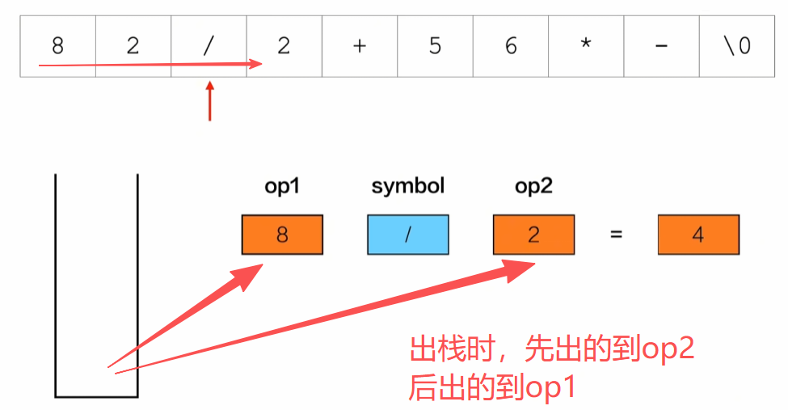

   从左到右依次进栈，遇到符号就出栈将符号输入到`symbol`将`op1`与`op2`依次进行运算，得**出值之后再将其压栈回去**

3. 检索到`\0`时为语句结束标志，弹出最后的值，得出结果，结束程序。

代码示例：

```c
#include <stdio.h>
#include <stdlib.h>
#include <string.h>
#include <ctype.h>

// 定义栈的最大容量
#define MAX_STACK_SIZE 100

// 使用枚举定义标记类型，用于数据识别
typedef enum {
    TOKEN_NUMBER,    // 数字
    TOKEN_OPERATOR,  // 运算符
    TOKEN_INVALID    // 无效标记
} TokenType;

// 使用枚举定义运算符类型
typedef enum {
    OP_ADD,     // 加法 +
    OP_SUB,     // 减法 -
    OP_MUL,     // 乘法 *
    OP_DIV,     // 除法 /
    OP_NONE     // 无运算符
} OperatorType;//如果有括号可以自己加

// 栈结构定义
typedef struct {
    int data[MAX_STACK_SIZE];  // 栈数据存储
    int top;                   // 栈顶指针
} Stack;

// 标记结构定义，用于存储解析后的表达式元素
typedef struct {
    TokenType type;      // 标记类型（数字/运算符/无效）
    int value;           // 如果是数字，存储数值
    OperatorType op;     // 如果是运算符，存储运算符类型
} Token;

/**
 * @brief 初始化栈
 * @param s 栈指针
 */
void initStack(Stack *s) {
    s->top = -1;  // 栈顶指针初始化为-1，表示空栈
}

/**
 * @brief 判断栈是否为空
 * @param s 栈指针
 * @return 1-空栈，0-非空栈
 */
int isEmpty(Stack *s) {
    return s->top == -1;
}

/**
 * @brief 判断栈是否已满
 * @param s 栈指针
 * @return 1-栈满，0-栈未满
 */
int isFull(Stack *s) {
    return s->top == MAX_STACK_SIZE - 1;
}

/**
 * @brief 元素入栈
 * @param s 栈指针
 * @param value 要入栈的值
 * @return 1-成功，0-失败（栈满）
 */
int push(Stack *s, int value) {
    if (isFull(s)) {
        printf("错误：栈已满，无法压入元素 %d\n", value);
        return 0;
    }
    s->data[++(s->top)] = value;  // 栈顶指针先加1，然后存入元素
    return 1;
}

/**
 * @brief 元素出栈
 * @param s 栈指针
 * @param value 用于接收出栈值的指针
 * @return 1-成功，0-失败（栈空）
 */
int pop(Stack *s, int *value) {
    if (isEmpty(s)) {
        printf("错误：栈为空，无法弹出元素\n");
        return 0;
    }
    *value = s->data[(s->top)--];  // 先取出栈顶元素，然后栈顶指针减1
    return 1;
}

/**
 * @brief 查看栈顶元素（不弹出）
 * @param s 栈指针
 * @param value 用于接收栈顶值的指针
 * @return 1-成功，0-失败（栈空）
 */
int peek(Stack *s, int *value) {
    if (isEmpty(s)) {
        return 0;
    }
    *value = s->data[s->top];
    return 1;
}

/**
 * @brief 解析字符串为标记
 * @param str 输入字符串
 * @param token 用于存储解析结果的标记指针
 * @return 1-成功解析，0-解析失败
 */
int parseToken(const char *str, Token *token) {
    // 检查是否为数字
    if (isdigit(str[0])) {
        token->type = TOKEN_NUMBER;
        token->value = atoi(str);  // 将字符串转换为整数
        token->op = OP_NONE;
        return 1;
    }
    
    // 检查是否为运算符
    token->type = TOKEN_OPERATOR;
    switch (str[0]) {
        case '+': token->op = OP_ADD; break;
        case '-': token->op = OP_SUB; break;
        case '*': token->op = OP_MUL; break;
        case '/': token->op = OP_DIV; break;
        default: 
            token->type = TOKEN_INVALID;
            return 0;
    }
    
    return 1;
}

/**
 * @brief 执行运算操作
 * @param op 运算符类型
 * @param a 第一个操作数
 * @param b 第二个操作数
 * @param result 运算结果指针
 * @return 1-成功，0-失败（如除零错误）
 */
int performOperation(OperatorType op, int a, int b, int *result) {
    switch (op) {
        case OP_ADD:
            *result = a + b;
            break;
        case OP_SUB:
            *result = a - b;
            break;
        case OP_MUL:
            *result = a * b;
            break;
        case OP_DIV:
            if (b == 0) {
                printf("错误：除零错误\n");
                return 0;
            }
            *result = a / b;
            break;
        default:
            printf("错误：未知运算符\n");
            return 0;
    }
    return 1;
}

/**
 * @brief 计算后缀表达式
 * @param expression 后缀表达式字符串数组
 * @param count 表达式元素数量
 * @param result 计算结果指针
 * @return 1-计算成功，0-计算失败
 */
int evaluatePostfix(char *expression[], int count, int *result) {
    Stack stack;
    initStack(&stack);
    
    for (int i = 0; i < count; i++) {
        Token token;
        
        // 解析当前标记
        if (!parseToken(expression[i], &token)) {
            printf("错误：无法解析标记 '%s'\n", expression[i]);
            return 0;
        }
        
        if (token.type == TOKEN_NUMBER) {
            // 如果是数字，压入栈中
            if (!push(&stack, token.value)) {
                return 0;
            }
        } 
        else if (token.type == TOKEN_OPERATOR) {
            // 如果是运算符，从栈中弹出两个操作数
            int operand2, operand1;
            if (!pop(&stack, &operand2) || !pop(&stack, &operand1)) {
                printf("错误：操作数不足\n");
                return 0;
            }
            
            // 执行运算
            int operationResult;
            if (!performOperation(token.op, operand1, operand2, &operationResult)) {
                return 0;
            }
            
            // 将运算结果压回栈中
            if (!push(&stack, operationResult)) {
                return 0;
            }
        }
    }
    
    // 最终结果应该在栈顶
    if (!pop(&stack, result)) {
        printf("错误：无法获取最终结果\n");
        return 0;
    }
    
    // 检查栈是否为空（应该只剩下结果）
    if (!isEmpty(&stack)) {
        printf("错误：表达式不完整\n");
        return 0;
    }
    
    return 1;
}

/**
 * @brief 打印栈的当前状态（用于调试）
 * @param s 栈指针
 */
void printStack(Stack *s) {
    printf("栈状态：[");
    for (int i = 0; i <= s->top; i++) {
        printf("%d", s->data[i]);
        if (i < s->top) {
            printf(", ");
        }
    }
    printf("]\n");
}

int main() {
    // 后缀表达式：8 2 / 2 + 5 6 * -
    // 等价于中缀表达式：(8 / 2) + 2 - (5 * 6)
    // 计算过程：8/2=4, 4+2=6, 5*6=30, 6-30=-24
    
    char *expression[] = {"8", "2", "/", "2", "+", "5", "6", "*", "-"};
    int count = sizeof(expression) / sizeof(expression[0]);
    
    printf("后缀表达式: ");
    for (int i = 0; i < count; i++) {
        printf("%s ", expression[i]);
    }
    printf("\n");
    
    int result;
    if (evaluatePostfix(expression, count, &result)) {
        printf("计算结果: %d\n", result);
        
        // 验证计算过程
        printf("\n计算过程验证:\n");
        printf("8 / 2 = 4\n");
        printf("4 + 2 = 6\n"); 
        printf("5 * 6 = 30\n");
        printf("6 - 30 = -24\n");
    } else {
        printf("计算失败\n");
    }
    
    return 0;
}
```


#### 中缀转换为后缀

将中缀表达式转为后缀表达式的代码实现 

以`x / ( i - j ) * y`转化为`x i j - / y * `为例

具体步骤：

将中缀表达式放入字符类型的数组中，对其符号按照**优先级排列**后进栈

找到的如果是操作数，则直接输出，运算符保留到事先放有优先级为`0`的栈中（压栈）

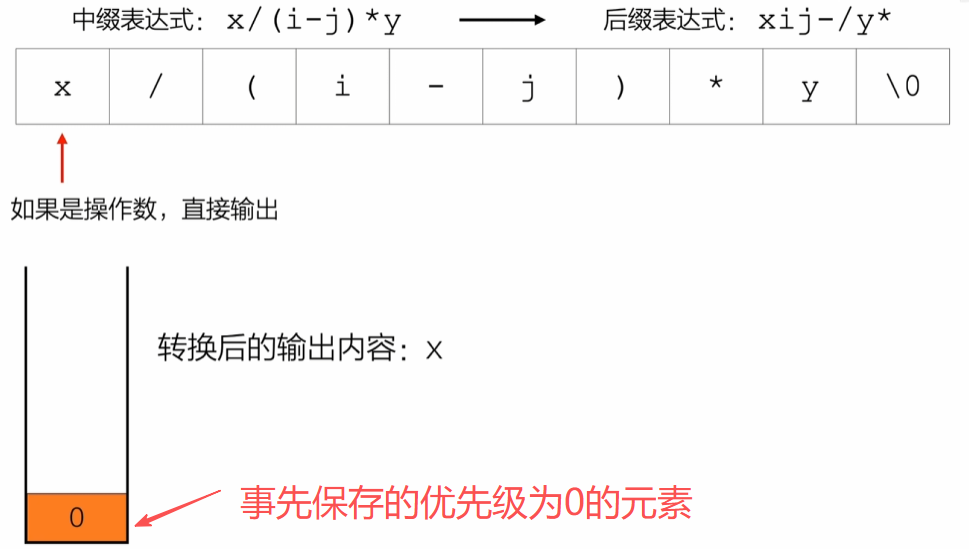

如果是运算符，判断优先级，如果优先级大于栈顶元素，就压入栈中（`0`的优先级最低）

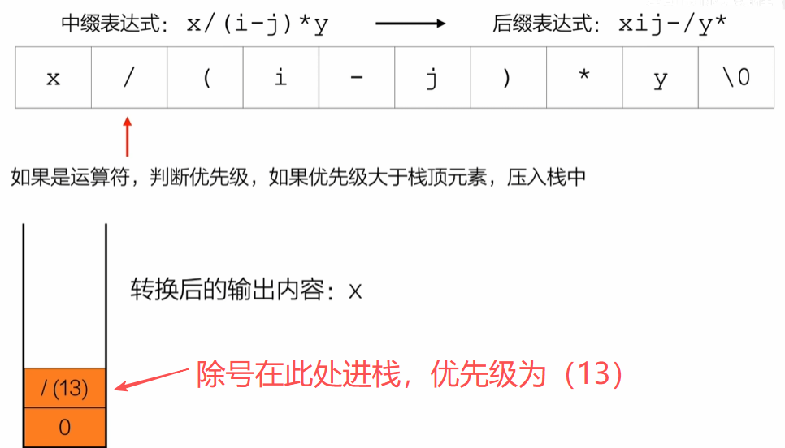

特殊的是，**左括号**`（`,在栈外时就处于最高优先级，在栈内属于最低优先级`0`，意思就是在栈外时确保一定能进栈，到栈内时确保其他符号可以进栈。

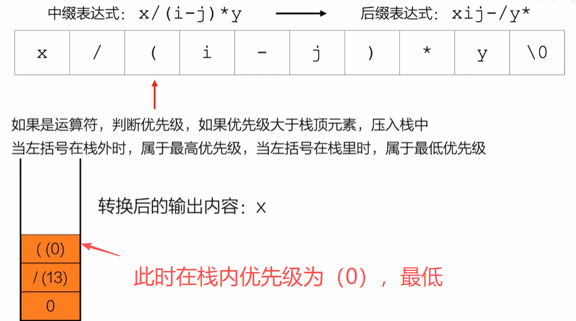

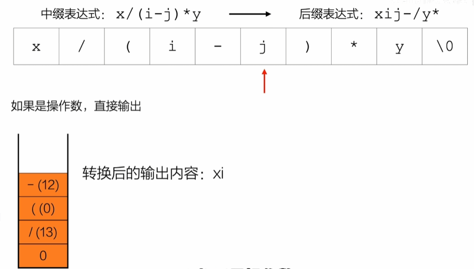

遇到**右括号**`)`时,将把栈内元素进行持续出栈，使得栈顶元素为左括号，最后左括号也出栈，但是不打印显示

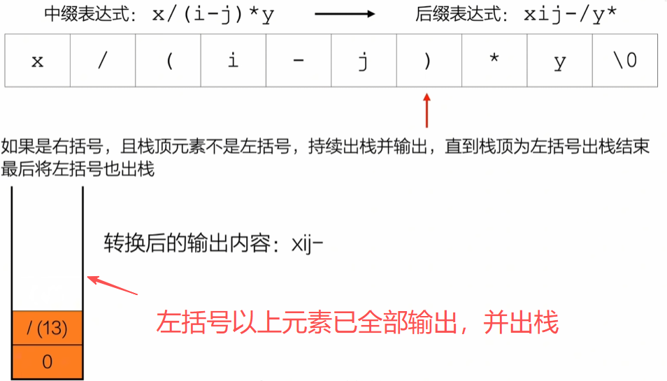

如果运算符判断的优先级（大于等于≥）栈顶元素，先将栈顶元素进行出栈输出，再把后一个元素进行入栈。

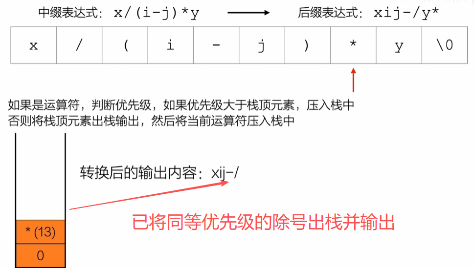

遇到`/0`时就将栈中元素依次输出，直到栈底元素`0`处

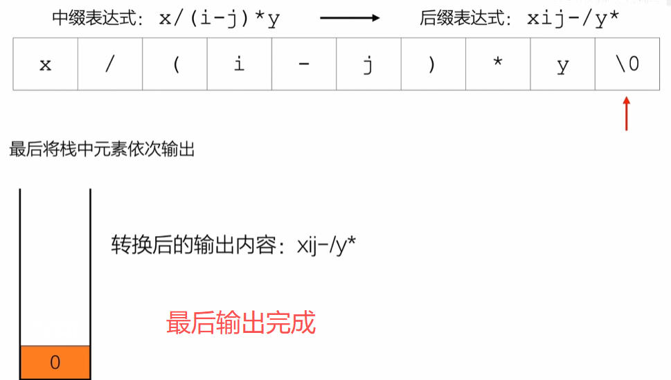

代码示例：

```c
#include <stdio.h>
#include <stdlib.h>
#include <string.h>
#include <ctype.h>

// 定义栈的最大容量
#define MAX_STACK_SIZE 100

// 运算符优先级枚举
typedef enum {
    PRIORITY_LOWEST = 0,   // 最低优先级
    PRIORITY_ADD_SUB = 1,  // 加减法优先级
    PRIORITY_MUL_DIV = 2,  // 乘除法优先级
    PRIORITY_HIGHEST = 3   // 最高优先级（括号等）
} Priority;

// 标记类型枚举
typedef enum {
    TOKEN_OPERAND,    // 操作数
    TOKEN_OPERATOR,   // 运算符
    TOKEN_LEFT_PAREN, // 左括号
    TOKEN_RIGHT_PAREN // 右括号
} TokenType;

// 栈结构定义
typedef struct {
    char data[MAX_STACK_SIZE];  // 栈数据存储（存储运算符）
    int top;                   // 栈顶指针
} Stack;

/**
 * @brief 初始化栈
 * @param s 栈指针
 */
void initStack(Stack *s) {
    s->top = -1;  // 栈顶指针初始化为-1，表示空栈
}

/**
 * @brief 判断栈是否为空
 * @param s 栈指针
 * @return 1-空栈，0-非空栈
 */
int isEmpty(Stack *s) {
    return s->top == -1;
}

/**
 * @brief 判断栈是否已满
 * @param s 栈指针
 * @return 1-栈满，0-栈未满
 */
int isFull(Stack *s) {
    return s->top == MAX_STACK_SIZE - 1;
}

/**
 * @brief 元素入栈
 * @param s 栈指针
 * @param value 要入栈的值
 * @return 1-成功，0-失败（栈满）
 */
int push(Stack *s, char value) {
    if (isFull(s)) {
        printf("错误：栈已满，无法压入元素 %c\n", value);
        return 0;
    }
    s->data[++(s->top)] = value;  // 栈顶指针先加1，然后存入元素
    return 1;
}

/**
 * @brief 元素出栈
 * @param s 栈指针
 * @param value 用于接收出栈值的指针
 * @return 1-成功，0-失败（栈空）
 */
int pop(Stack *s, char *value) {
    if (isEmpty(s)) {
        printf("错误：栈为空，无法弹出元素\n");
        return 0;
    }
    *value = s->data[(s->top)--];  // 先取出栈顶元素，然后栈顶指针减1
    return 1;
}

/**
 * @brief 查看栈顶元素（不弹出）
 * @param s 栈指针
 * @param value 用于接收栈顶值的指针
 * @return 1-成功，0-失败（栈空）
 */
int peek(Stack *s, char *value) {
    if (isEmpty(s)) {
        return 0;
    }
    *value = s->data[s->top];
    return 1;
}

/**
 * @brief 获取运算符的优先级
 * @param op 运算符
 * @return 优先级数值
 */
Priority getPriority(char op) {
    switch (op) {
        case '+':
        case '-':
            return PRIORITY_ADD_SUB;
        case '*':
        case '/':
            return PRIORITY_MUL_DIV;
        case '(':
        case ')':
            return PRIORITY_HIGHEST;
        default:
            return PRIORITY_LOWEST;
    }
}

/**
 * @brief 判断字符是否为运算符
 * @param c 要判断的字符
 * @return 1-是运算符，0-不是运算符
 */
int isOperator(char c) {
    return c == '+' || c == '-' || c == '*' || c == '/';
}

/**
 * @brief 判断字符是否为操作数（字母）
 * @param c 要判断的字符
 * @return 1-是操作数，0-不是操作数
 */
int isOperand(char c) {
    return isalpha(c);  // 字母即为操作数
}

/**
 * @brief 中缀表达式转后缀表达式
 * @param infix 中缀表达式字符串
 * @param postfix 用于存储后缀表达式的字符数组
 * @return 1-转换成功，0-转换失败
 */
int infixToPostfix(const char *infix, char postfix[]) {
    Stack stack;
    initStack(&stack);
    int postfixIndex = 0;  // 后缀表达式索引
    char currentChar;
    char stackTop;
    
    printf("转换过程:\n");
    printf("中缀表达式: %s\n", infix);
    
    for (int i = 0; infix[i] != '\0'; i++) {
        currentChar = infix[i];
        
        // 跳过空格
        if (currentChar == ' ') {
            continue;
        }
        
        printf("当前字符: %c, ", currentChar);
        
        // 如果是操作数（字母），直接添加到后缀表达式
        if (isOperand(currentChar)) {
            postfix[postfixIndex++] = currentChar;
            postfix[postfixIndex++] = ' ';  // 添加空格分隔
            printf("操作数，直接输出 -> 后缀表达式: %.*s\n", postfixIndex, postfix);
        }
        // 如果是左括号，压入栈中
        else if (currentChar == '(') {
            push(&stack, currentChar);
            printf("左括号，压入栈中\n");
        }
        // 如果是右括号，弹出栈中元素直到遇到左括号
        else if (currentChar == ')') {
            printf("右括号，弹出栈中元素直到左括号: ");
            while (peek(&stack, &stackTop) && stackTop != '(') {
                pop(&stack, &stackTop);
                postfix[postfixIndex++] = stackTop;
                postfix[postfixIndex++] = ' ';
                printf("%c ", stackTop);
            }
            // 弹出左括号（但不添加到后缀表达式）
            if (peek(&stack, &stackTop) && stackTop == '(') {
                pop(&stack, &stackTop);
            }
            printf("\n");
        }
        // 如果是运算符
        else if (isOperator(currentChar)) {
            printf("运算符 %c, ", currentChar);
            
            // 当栈不为空，且栈顶运算符优先级不低于当前运算符时，弹出栈顶运算符
            while (peek(&stack, &stackTop) && 
                   isOperator(stackTop) && 
                   getPriority(stackTop) >= getPriority(currentChar)) {
                pop(&stack, &stackTop);
                postfix[postfixIndex++] = stackTop;
                postfix[postfixIndex++] = ' ';
                printf("弹出 %c ", stackTop);
            }
            
            // 当前运算符压入栈中
            push(&stack, currentChar);
            printf("压入 %c\n", currentChar);
        }
        
        // 打印当前栈状态
        printf("栈状态: [");
        for (int j = 0; j <= stack.top; j++) {
            printf("%c", stack.data[j]);
            if (j < stack.top) printf(" ");
        }
        printf("]\n");
        printf("当前后缀表达式: %.*s\n\n", postfixIndex, postfix);
    }
    
    // 将栈中剩余的运算符全部弹出
    printf("处理栈中剩余运算符: ");
    while (!isEmpty(&stack)) {
        pop(&stack, &stackTop);
        // 如果还有左括号在栈中，说明括号不匹配
        if (stackTop == '(') {
            printf("\n错误：括号不匹配\n");
            return 0;
        }
        postfix[postfixIndex++] = stackTop;
        postfix[postfixIndex++] = ' ';
        printf("%c ", stackTop);
    }
    printf("\n");
    
    // 确保后缀表达式以空字符结尾
    if (postfixIndex > 0) {
        postfix[postfixIndex - 1] = '\0';  // 移除最后一个空格
    } else {
        postfix[0] = '\0';
    }
    
    return 1;
}

/**
 * @brief 打印转换的详细步骤说明
 */
void printConversionSteps() {
    printf("\n=== 中缀转后缀转换规则 ===\n");
    printf("1. 操作数（字母）直接输出\n");
    printf("2. 运算符根据优先级处理：\n");
    printf("   - 乘除法(*, /)优先级高于加减法(+, -)\n");
    printf("   - 相同优先级从左到右计算\n");
    printf("3. 左括号'('直接压入栈\n");
    printf("4. 右括号')'弹出栈中元素直到遇到左括号\n");
    printf("5. 表达式结束后，弹出栈中所有运算符\n");
    printf("==========================\n\n");
}

int main() {
    // 原始中缀表达式：x / ( i - j ) * y
    char infix[] = "x/(i-j)*y";
    char postfix[MAX_STACK_SIZE * 2];  // 后缀表达式存储数组
    
    printf("中缀表达式转后缀表达式程序\n");
    printf("原始公式: %s\n\n", infix);
    
    // 打印转换规则
    printConversionSteps();
    
    // 执行转换
    if (infixToPostfix(infix, postfix)) {
        printf("\n转换成功！\n");
        printf("中缀表达式: %s\n", infix);
        printf("后缀表达式: %s\n", postfix);
        
        // 验证转换结果
        printf("\n验证转换:\n");
        printf("x / ( i - j ) * y 应该转换为: x i j - / y *\n");
        printf("实际转换结果: %s\n", postfix);
        
        // 比较预期结果
        if (strcmp(postfix, "x i j - / y *") == 0) {
            printf("✓ 转换结果正确！\n");
        } else {
            printf("✗ 转换结果与预期不符\n");
        }
    } else {
        printf("转换失败！\n");
    }
    
    // 测试其他例子
    printf("\n--- 其他测试例子 ---\n");
    char testInfix[] = "a+b*c-d";
    char testPostfix[MAX_STACK_SIZE * 2];
    
    if (infixToPostfix(testInfix, testPostfix)) {
        printf("中缀: %s -> 后缀: %s\n", testInfix, testPostfix);
    }
    
    return 0;
}
```

主要模块功能：

1. **栈操作模块**：
   - `initStack()`: 初始化栈
   - `push()/pop()`: 压栈/出栈操作
   - `peek()`: 查看栈顶元素
     `peek（）`：
   - `isEmpty()/isFull()`: 栈状态检查
     `isEmpty（）/isFull（）`：
2. **优先级管理模块**：
   - `getPriority()`: 获取运算符优先级
   - 使用枚举类型明确定义优先级等级
3. **字符识别模块**：
   - `isOperator()`: 判断是否为运算符
   - `isOperand()`: 判断是否为操作数
4. **核心转换模块**：
   - `infixToPostfix()`: 中缀转后缀的主要算法
   - 处理各种情况：操作数、运算符、括号
5. **辅助功能模块**：
   - `printConversionSteps()`: 打印转换规则说明
   - 详细的调试输出，展示每一步的转换过程

转换算法核心逻辑：

1. **操作数**：直接输出到后缀表达式
2. **运算符**：
   - 与栈顶运算符比较优先级
   - 弹出优先级更高或相等的运算符
   - 当前运算符压栈
3. **左括号**：直接压栈
4. **右括号**：弹出栈中元素直到遇到左括号
5. **结束处理**：弹出栈中所有剩余运算符


## 字符串 KMP算法

### 字符串

在纯c语言中无字符串的数据类型，所以在表答时使用字符型的数组来进行初始化如：`char str[]="HelloWorld";`

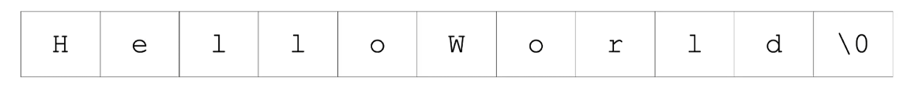

`#include<string.h>`：`string.h`函数库

`strcpy`：由于字符串不能直接赋值则使用`strcpy`函数进行赋值

```c
#include<stdio.h>
#include<string.h>
int main()
{
    char str[11];
    strcpy(str,"HelloWorld");
}
```

`strlen`:此函数用于得取真实的字符串长度（除去`\0`),相比于`sizeof()`多了个`\0`的一个字节,用法和`sizeof()`一致


### 字符串匹配-朴素匹配

目的是在字符串里寻找模式串进行匹配

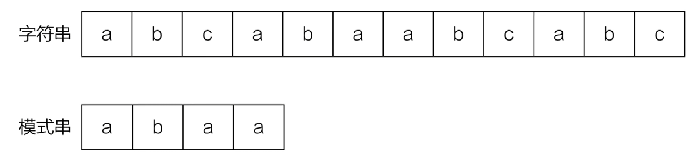

朴素匹配模式，将字符进行逐一排查，如果不同就像后移动一位，再对模式串进行比对。时间复杂度为**O((n-m+1)*m)**。

代码示例：

```c
#include<stdio.h>
#include<string.h>
int strMath(char* str,char* pattern)
{
    int n=strlen(str),m=strlem(pattern);
    for(int i=0;i<=(n-m);i++)
    {
        int j = 0;
        while(j<m)
        {
            if(str[i] == pattern[j])
            {
              i++;
              j++;
            }//对模式串进行逐个比对
            else
            {
                i = i - j;
                break;//如果有一个不同，就打破while循环，对下一个进行判断
            }
        }
        if( j == m )
        {
            return i - j;//找到后返回第一个字符在字符串的地址
        }
    }
    return -1;
}
```

### 字符串匹配-KMP匹配

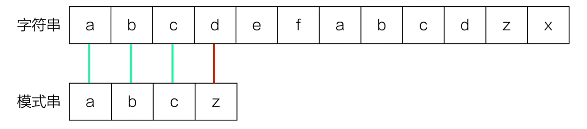

相比于上个方法，发现d-z无法对上，直接就使用d-a进行匹配，往后循环，总体步骤为：

1.基于模式串确定`next`数组

2.利用`next`数组完成字符串的匹配

`next`数组：*在匹配过程中，发生字符不匹配时，`next`数组用来帮助确定下一次的匹配位置*

前缀、后缀：前缀就是除最后一个元素以外，前面所有元素所顺序组成的子字符串。后缀同理，就是除第一个元素以外……。

例如有一个字符串 a b a a b c，其

前缀有：a , a b , a b a , a b a a ,a b a a b 。

后缀有：c , b c , a b c , a a b c , b a a b c 。


**第一步：基于模式串确定`next`数组**

遍历**模式串**，获取每个字符前面的内容，根据前，后缀相同的最大长度填写对应的 `next`中的值，以下图为例简述得取`next`数组的过程：

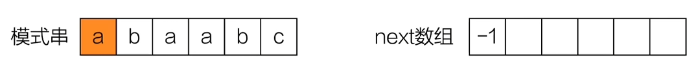

由于数组头前面没内容，使用-1来表示前面没内容。

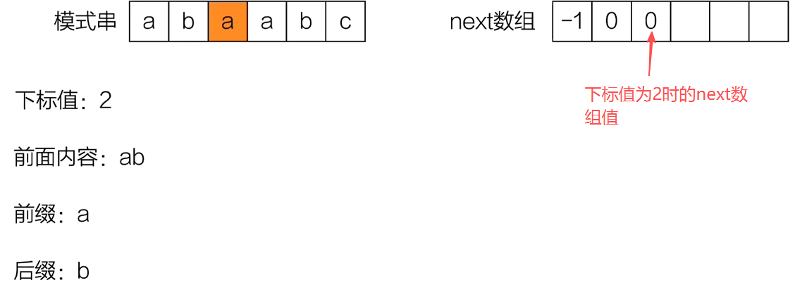

找公共部分，然后看公共部分长度最大的是多少。

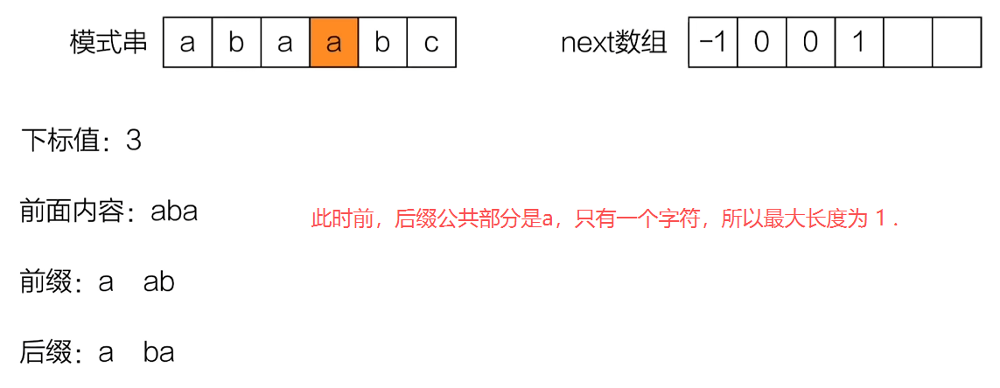

直到最后找完`next`数组。*注：这里多圈选了两个不不相关的 a，b*

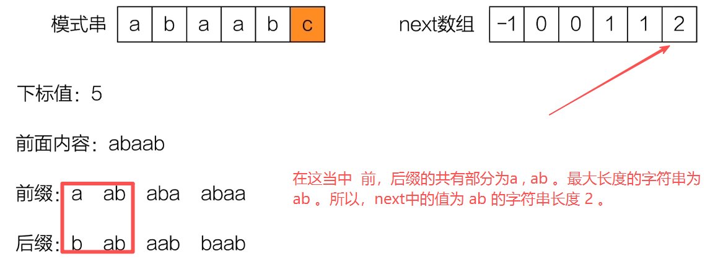


**第二步：利用`next`数组完成字符串的匹配**

找到`next`数组后，先将模式串与字符串进行挨个比对，若发现与模式串的不同，将模式串的数组下标使用到`next`数组中，用来确定模式串向后移动比对的距离。

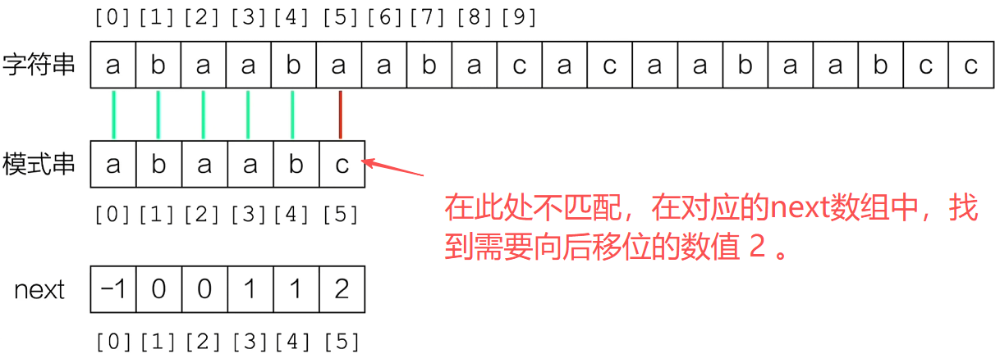

字符串不变为[5]处，将模式串移动到[2]处

变成类似这样，继续循环比对。

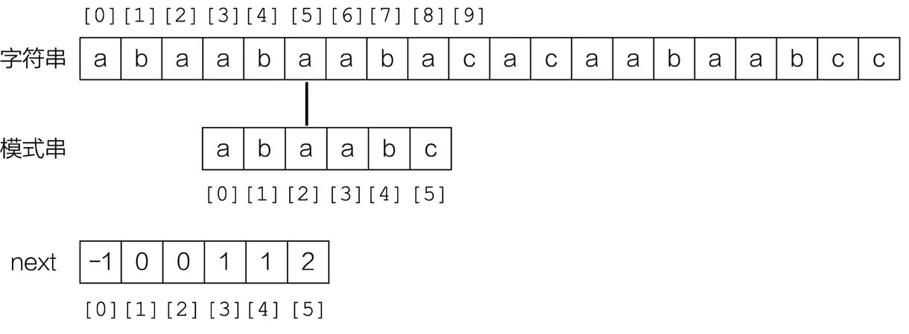

设`i`为字符串的数组地址位置，`j`为模式串的数组地址位置

具体逻辑如下图：

```text
f(i,j) = 
    ⎧ f(i+1, j+1)          if T[i] = P[j]
    ⎨ f(i, next[j])        if T[i] ≠ P[j] and j > 0
    ⎩ f(i+1, 0)            if T[i] ≠ P[j] and j = 0
```


## 多维数组和特殊矩阵压缩

**一维数组**

```c
int main()
{
	int a[] = {16,45,23,43,26,43};
}
```

**二维数组**

数据类型    数组名     [数组长度 ]    [数组长度]

```c
int a[5][6];
```


## 树和二叉树

### 树与二叉树的定义

#### **树**

**树**是一个或者多个节点的有限集合，存在一个称为根的特定节点，其余的节点被分为`n`个互不相交的集合$T_1,T_2,T_3,···，T_n$,其中每一个集合都是一棵树。$T_1,T_2,T_3,···，T_n$称为根节点的子树。

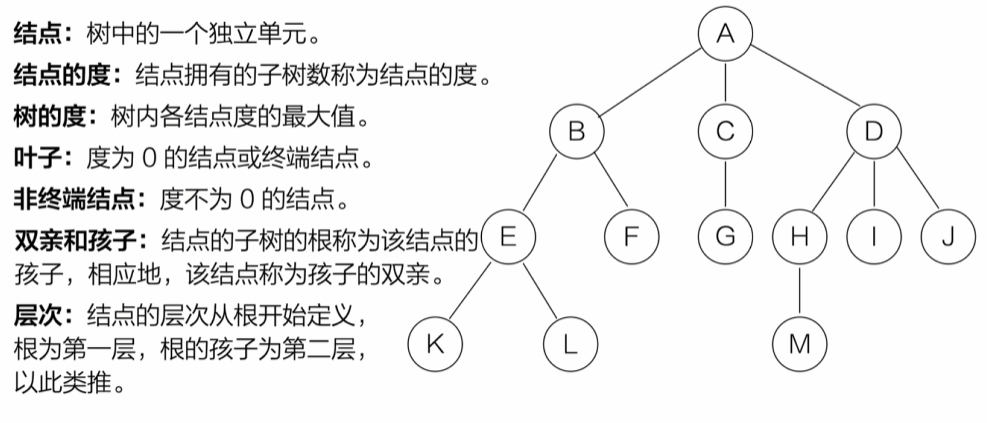

**性质一：树当中所有结点数等于所有结点的度数之和加1**

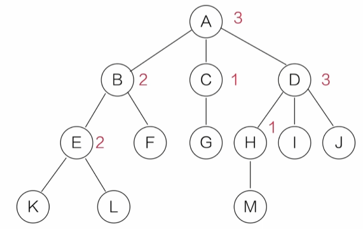

意思就是所有结点（A,B,E,C,D,H）的度相加，就是等于树内所有元素的数量

**性质二：对于度为$m$的树，第$i$层上最多有$m^{i-1}$个结点**

假如上图树的度（每个节点的最大子节点数）是$3$，那么第$3$层就有最多$3^2=9$的结点。

**性质三：对于高度为$h$，度为$m$的树，最多有$（m^h-1）/（m-1）$个结点**

就是等比数列求和


#### **二叉树**

二叉树（Binary Tree）是$n$（$n≥0$)个结点所构成的集合，它或为空树（$n=0$）或为非空树。对于非空树T：

1. 有且仅有一个称为根的结点
2. 除根结点以外的其余结点分为两个互不相交的子集$T_1$和$ T_2$，分别称为 $T$的左子树和右子树，且$T_1$和$ T_2$本身又都是二叉树。
3. 二叉树每个结点至多只有两棵子树。
4. 二叉树的子树有左右之分，其次序不能任意颠倒。

**二叉树的基本形态**

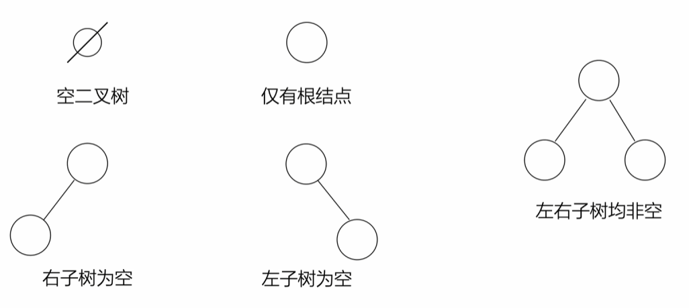

特殊：满二叉树，完全二叉树，斜树，二叉排序树，二叉搜索树

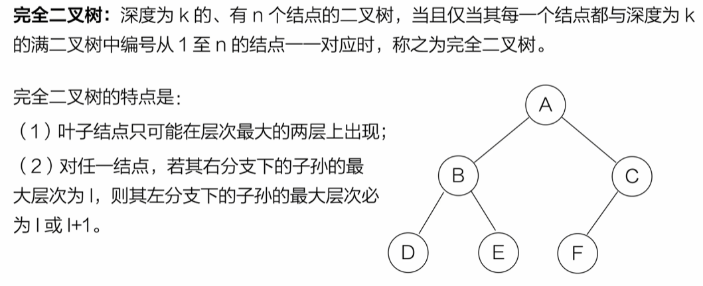

对于完全二叉树总的来说：没有左子树，不能有右子树，上一层没有铺满，不能有下一层。以下是非完全二叉树的典型示例

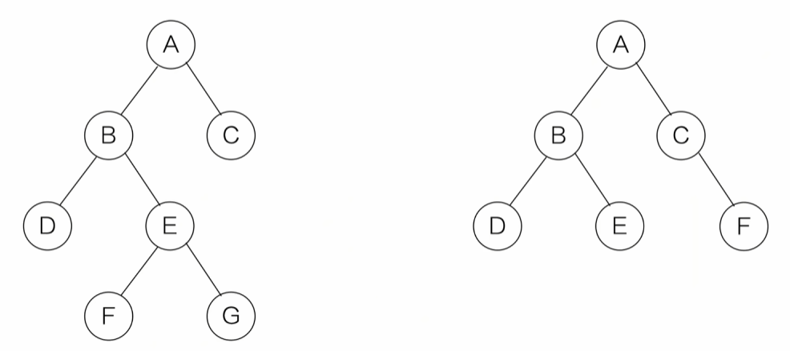


**性质一：二叉树的$i$层最多有$2^{i-1}$($i≥1$)个结点**

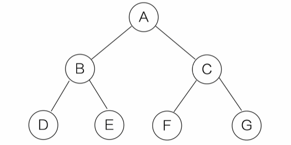

**性质二：深度为$k$的二叉树最多有$2^k-1$($k≥1$)个结点。**

**性质三：对于任何非空的二叉树$T$,如果叶子结点的个数为$n_0$,而度为$2$的结点个数为$n_2$，则$n_0=n_2+1$。**

如上图，叶子结点数为$4$  (D,E,F,G),度为$2$的结点个数为$3$ （A,B,C）,满足上述表达式。


### 二叉树的实现

#### 顺序结构

除了满二叉树和完全二叉树除外，其他场景都比较浪费空间，所以就比较局限。

#### 链式结构

为了方便表达二叉树，所以就使用了链式结构，它可以表达任何形式的二叉树，实现动态内存分配，更节省空间。

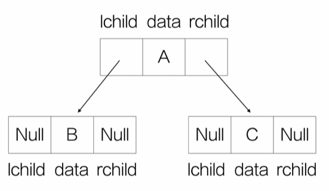

节点由三部分组成，

`lchild`:指向左侧孩子节点的指针域

`data`:用于存储数据元素的数据域

`rchild`:指向右侧孩子节点的指针域

用结构体声明的代码示例：

```c
typedef char ElemType;
typedef struct TreeNode
{
    ElemType data;
    TreeNode *lchild;
    TreeNode *rchild;
}TreeNode;
typedef TreeNode* Bitree;//对二叉树结构的指针别名
```


##### 二叉树的遍历

###### 1.递归-前序遍历

先访问根结点，然后访问左分支上遇到的每一个结点，持续这一过程，直到遇到空结点为止。这时，返回到最近的有右孩子的祖先结点，并从该结点的右孩子开始继续遍历。

使用递归调用，来进行解决，顺序为A B D H K E C F I G J

1.先遍历左侧孩子节点，进行逐级递归调用

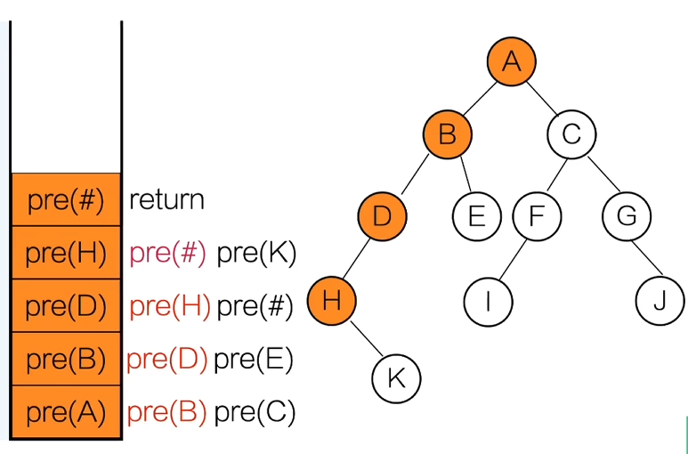

2.调用到空节点时就输出，并返回上一级访问上一个父节点的右侧孩子节点。

3.逐级进行递归循环，最后就全部遍历出来了。

```c
void preOrder(BiTree T)
{
    if (T == NULL)
    {
        return;
    }
    printf("%c ", T->data);//访问根节点，打印节点数据
    preOrder(T->lchild);//递归遍历左子树
    preOrder(T->rchild);//递归遍历右子树
}
```


###### 2.递归-中序遍历

先访问根结点，向树的左下方移动，直到遇到空结点为止，然后访问空结点的父结点。接着继续遍历该结点的右子树，如果右子树没的子树可以遍历，那么继续遍历上一层最后一个未被访问的结点 

顺序为：H K D B E A I F C G J 

1.先层层向下遍历，找到空节点，找到之后使得空节点的父节点出栈打印

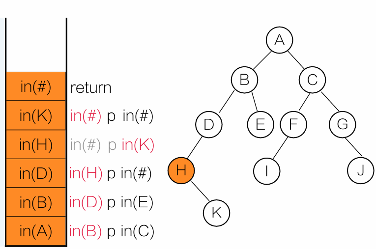

2.对出栈的父节点检查他的右节点

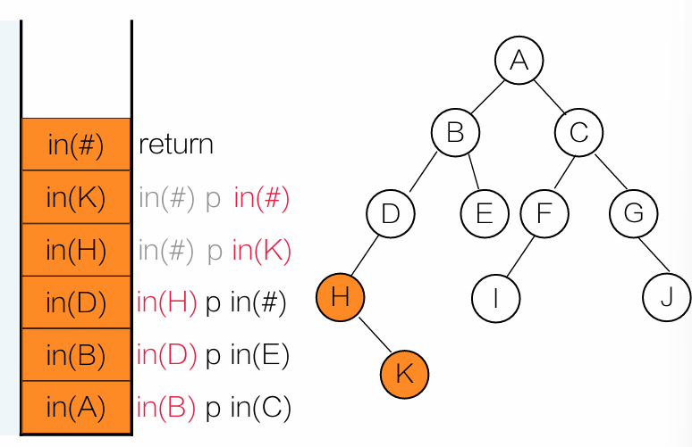

3.层层向上对其进行判别，最后遍历全部

```c
void inOrder(BiTree T)
{
    if (T == NULL)
    {
        return;
    }
    inOrder(T->lchild);//遍历左子树
    printf("%c ", T->data);//访问根节点，打印节点数据
    inOrder(T->rchild);//遍历右子树
}
```


###### 3.递归-后序遍历

从根结点开始先访问结点的左右儿子，再对该结点进行访问。这就意味着结点的儿子 将在该结点之前输出。

顺序为：K H D E B I F J G C A

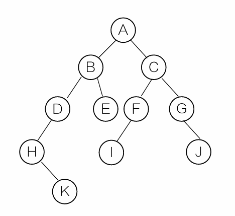

1.先对左侧孩子进行遍历输出

2.遇到父节点判断是否有右侧的孩子节点，进行遍历输出

3.最后再输出根节点

```c
 void postOrder(BiTree T) 
{ 
    if (T == NULL) 
    { 
		return; 
    } 
    postOrder(T->lchild); //遍历左侧子节点
    postOrder(T->rchild); //遍历右侧子节点
    printf("%c ", T->data); //输出节点，打印
}
```


###### 例：非递归-前序遍历

`Stack *s`指的是建立一个栈，`BiTree`指的是二叉树的根节点。

`Stack *s`：

栈起到一个临时存储的作用；

使得树指针`T`能够指向所需要的地方；

类似于递归调用中系统自带栈的作用；

实现指针向上跳回，复查右侧子节点作用


具体过程为：*注：可以手动画个栈图试试*

1.沿着左侧子节点遍历，并入栈；如此循环直到发现左侧子节点为空

2.跳出内部一层循环`while(T != NULL)`，对当前节点出栈，观察其是否有右侧节点（其右侧节点是否为空）

3.再次进行判断，当栈为空并且树指针为空，遍历结束

```c
void iterPreOrder(Stack *s, BiTree T) 
{ 
    while(T != NULL || isEmpty(s) != 0) 
/*在上文判断栈与是否为空的函数一致
isEmpty()函数 
	return 0 表示不为空
	return 1 表示栈为空
*/        
    { 
		while(T != NULL) 
		{ 
    		printf("%c ", T->data); 
    		push(s, T); 
    		T = T->lchild; 
		} 
        pop(s, &T); //代表出栈函数，上文有提及可以搜索
        T = T->rchild; 
    } 
}
```


###### 根据遍历结果推导二叉树

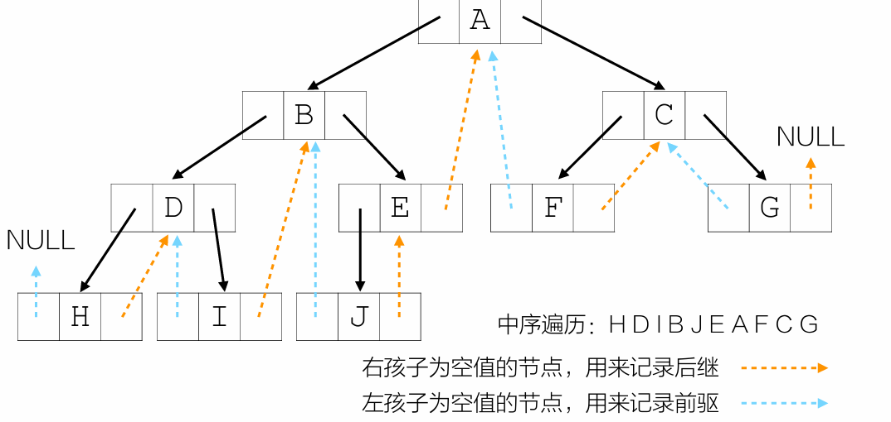


**那么该如何区分这个指针是指向那里的？**是指向左孩子（右孩子）还是指向的是该节点的前驱（后继）

解决方案就是：在原来三个标志域的情况下再增加两个标志位 `Ltag`,`Rtag`.


`Ltag`:

为 0 时，`lchild`指向该结点**左孩子**

为 1 时，`lchild`指向该结点的**前驱**

`Rtag`:

为 0 时，`rchild`指向该结点**右孩子**

为 1 时，`rchild`指向该结点的**后继**

##### 线索二叉树-存储结构

解决完以上可能出现的问题后，就需要构建相应的存储结构。

```c
typedef char ElemType;

typedef struct ThreadNode
{
    ElemType data;
    struct ThreadNode *lchild;
    struct ThreadNode *rchild;
    int ltag;
    int rtag;
} ThreadNode;

typedef ThreadNode* ThreadTree;
```

1. **`ElemType`**：定义为 `char` 类型，用于表示二叉树节点中存储的数据类型
2. **`ThreadNode` 结构体**：定义了线索二叉树的节点结构，包含：
   - `data`：节点数据
   - `lchild`：左孩子指针
   - `rchild`：右孩子指针
   - `ltag`：左标志位（0表示指向左孩子，1表示指向前驱）
   - `rtag`：右标志位（0表示指向右孩子，1表示指向后继）
3. **`ThreadTree`**：定义为 `ThreadNode*` 类型，是指向线索二叉树节点的指针类型


##### 线索二叉树-中序遍历线索化

首先，在遍历前需要进行相应的准备工作，来将二叉树变为一个可线索化遍历的循环链表

1. 头结点`thrt`的 `lchild` 指向二叉树的根 
2. 头结点`thrt`的 `rchild` 指向遍历的最后一个结点 
3. 第一个结点`-`的 `lchild` 指向头结点 
4. 最后一个结点`f`的 `rchild` 指向头结点


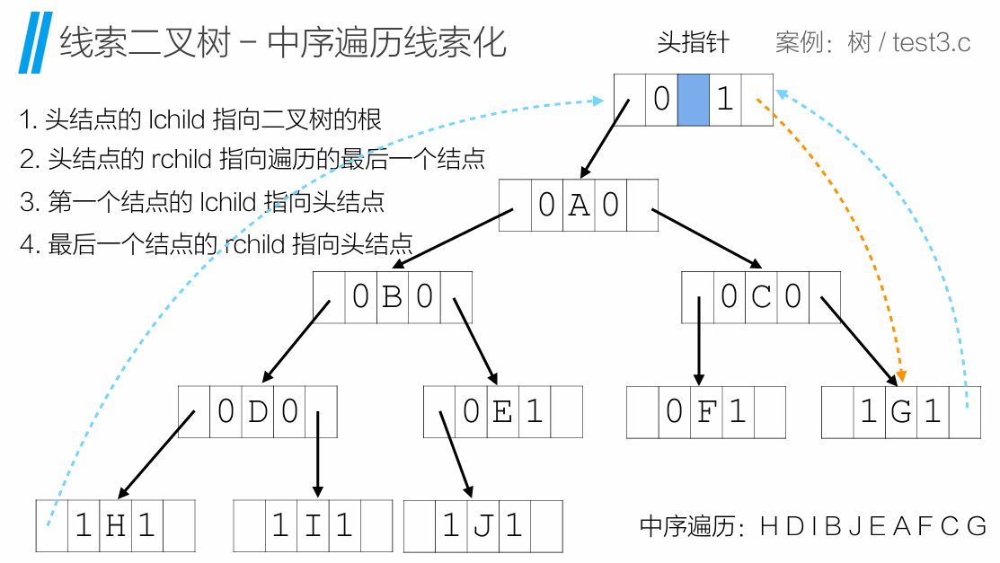

 代码示例：

```c
#include <stdio.h>
#include <stdlib.h>

typedef char ElemType;

typedef struct ThreadNode
{
    ElemType data;
    struct ThreadNode *lchild;
    struct ThreadNode *rchild;
    int ltag;  // 0:指向左孩子 1:指向前驱
    int rtag;  // 0:指向右孩子 1:指向后继
} ThreadNode;

typedef ThreadNode* ThreadTree;

// ==================== 辅助函数模块 ====================

/**
 * 创建新节点
 * @param data 节点数据
 * @return 新节点指针
 */
ThreadNode* CreateNode(ElemType data) {
    ThreadNode* newNode = (ThreadNode*)malloc(sizeof(ThreadNode));
    newNode->data = data;
    newNode->lchild = NULL;
    newNode->rchild = NULL;
    newNode->ltag = 0;  // 初始化为指向孩子
    newNode->rtag = 0;  // 初始化为指向孩子
    return newNode;
}

/**
 * 手动构建一个测试二叉树
 *         A
 *        / \
 *       B   C
 *      / \   \
 *     D   E   F
 *    /
 *   G
 * @return 树的根节点指针
 */
ThreadTree CreateTestTree() {
    ThreadNode* A = CreateNode('A');
    ThreadNode* B = CreateNode('B');
    ThreadNode* C = CreateNode('C');
    ThreadNode* D = CreateNode('D');
    ThreadNode* E = CreateNode('E');
    ThreadNode* F = CreateNode('F');
    ThreadNode* G = CreateNode('G');
    
    A->lchild = B;
    A->rchild = C;
    B->lchild = D;
    B->rchild = E;
    C->rchild = F;
    D->lchild = G;
    
    return A;
}

// ==================== 线索化模块 ====================

// 全局变量，用于记录当前访问节点的前驱节点
ThreadNode* pre = NULL;

/**
 * 中序遍历线索化递归函数
 * @param p 当前访问的节点
 */
void InThreading(ThreadTree p) {
    if (p == NULL) return;
    
    // 1. 递归线索化左子树
    InThreading(p->lchild);
    
    // 2. 处理当前节点
    // 如果左子树为空，建立前驱线索
    if (p->lchild == NULL) {
        p->ltag = 1;        // 设置左标志为线索
        p->lchild = pre;    // 左指针指向前驱
    }
    
    // 如果前驱节点的右子树为空，建立后继线索
    if (pre != NULL && pre->rchild == NULL) {
        pre->rtag = 1;      // 设置前驱节点的右标志为线索
        pre->rchild = p;    // 前驱节点的右指针指向当前节点（后继）
    }
    
    pre = p;  // 更新前驱节点为当前节点
    
    // 3. 递归线索化右子树
    InThreading(p->rchild);
}

/**
 * 中序线索化二叉树主函数
 * @param T 二叉树根节点
 */
void CreateInThread(ThreadTree T) {
    if (T == NULL) return;
    
    pre = NULL;  // 初始化前驱节点
    
    // 进行中序线索化
    InThreading(T);
    
    // 处理最后一个节点的后继线索（指向NULL）
    if (pre != NULL && pre->rchild == NULL) {
        pre->rtag = 1;
    }
    
    printf("二叉树中序线索化完成！\n");
}

// ==================== 遍历模块 ====================

/**
 * 找到中序遍历的第一个节点
 * @param T 线索二叉树根节点
 * @return 中序序列的第一个节点
 */
ThreadNode* FirstNode(ThreadTree T) {
    ThreadNode* p = T;
    // 一直向左找到最左下角的节点
    while (p != NULL && p->ltag == 0) {
        p = p->lchild;
    }
    return p;
}

/**
 * 找到中序遍历中指定节点的后继节点
 * @param p 当前节点
 * @return 后继节点
 */
ThreadNode* NextNode(ThreadNode* p) {
    if (p == NULL) return NULL;
    
    // 如果右指针是线索，直接返回后继
    if (p->rtag == 1) {
        return p->rchild;
    }
    // 否则返回右子树的中序第一个节点
    else {
        return FirstNode(p->rchild);
    }
}

/**
 * 中序遍历线索二叉树（非递归）
 * @param T 线索二叉树根节点
 */
void InOrderTraverse_Thr(ThreadTree T) {
    if (T == NULL) {
        printf("树为空！\n");
        return;
    }
    
    printf("中序遍历结果: ");
    
    ThreadNode* p = FirstNode(T);  // 找到中序第一个节点
    
    while (p != NULL) {
        printf("%c ", p->data);    // 访问节点
        p = NextNode(p);           // 找到后继节点
    }
    
    printf("\n");
}

/**
 * 逆向中序遍历线索二叉树（从最后一个节点开始向前遍历）
 * @param T 线索二叉树根节点
 */
void ReverseInOrderTraverse_Thr(ThreadTree T) {
    if (T == NULL) return;
    
    printf("逆向中序遍历结果: ");
    
    // 找到中序最后一个节点
    ThreadNode* p = T;
    while (p != NULL && p->rtag == 0) {
        p = p->rchild;
    }
    
    // 向前遍历
    while (p != NULL) {
        printf("%c ", p->data);
        
        // 如果左指针是线索，直接返回前驱
        if (p->ltag == 1) {
            p = p->lchild;
        }
        // 否则找到左子树的中序最后一个节点
        else {
            p = p->lchild;
            while (p != NULL && p->rtag == 0) {
                p = p->rchild;
            }
        }
    }
    
    printf("\n");
}

// ==================== 主函数模块 ====================

/**
 * 打印二叉树结构（用于验证）
 */
void PrintTreeStructure() {
    printf("\n二叉树结构:\n");
    printf("        A\n");
    printf("       / \\\\\n");
    printf("      B   C\n");
    printf("     / \\   \\\\\n");
    printf("    D   E   F\n");
    printf("   /\n");
    printf("  G\n");
}

int main() {
    // 1. 创建测试二叉树
    ThreadTree tree = CreateTestTree();
    PrintTreeStructure();
    
    // 2. 中序线索化二叉树
    CreateInThread(tree);
    
    // 3. 遍历线索二叉树
    InOrderTraverse_Thr(tree);
    ReverseInOrderTraverse_Thr(tree);
    
    return 0;
}
```

```text
二叉树结构:
        A
       / \
      B   C
     / \   \
    D   E   F
   /
  G

二叉树中序线索化完成！
中序遍历结果: G D B E A C F 
逆向中序遍历结果: F C A E B D G 
```


### **哈夫曼树(最优二叉树)**

**路径**：从树中一个结点到另一个结点之间的分支构成这两个结点之间的路径 

**路径长度**：路径上的分支数目

**树的路径长度**：从树根到每一个结点的路径长度之和

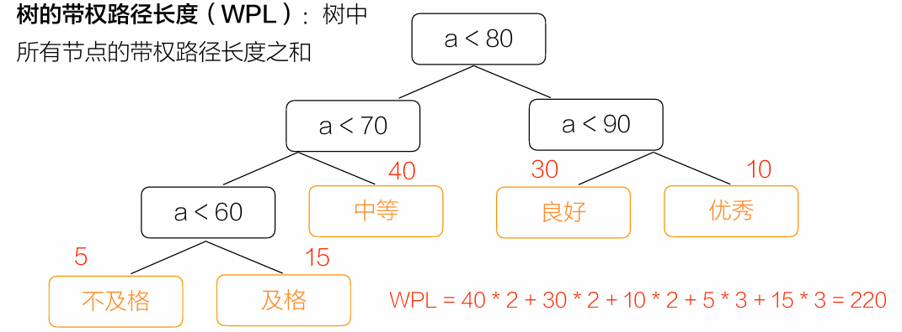

此时，定义

**哈夫曼树定义**：带权路径长度 WPL 最小的二叉树称为哈夫曼树 。

**构造哈夫曼树步骤**

1. 先把有权值的叶子结点按照从**小到大**的顺序排列成一个有序序列
   
2. 取两个最小权值的结点作为一个新结点 $N_1$ 的子结点
   
3. 将结点$N_1$ 替换刚刚取出的两个结点，并加入到有序序列中
   
4. 继续重复以上步骤


